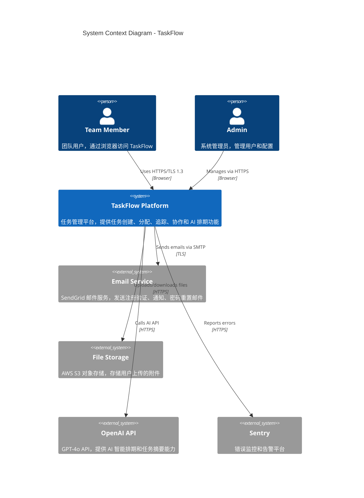
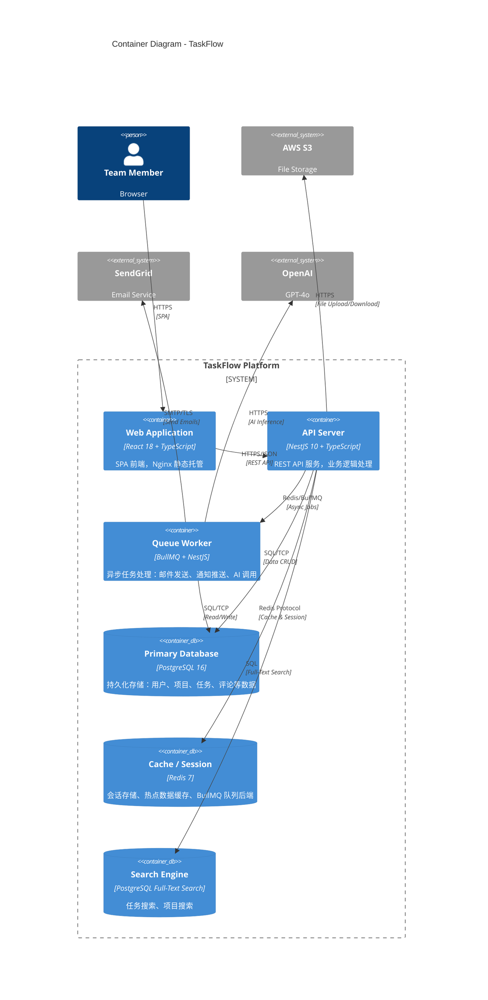
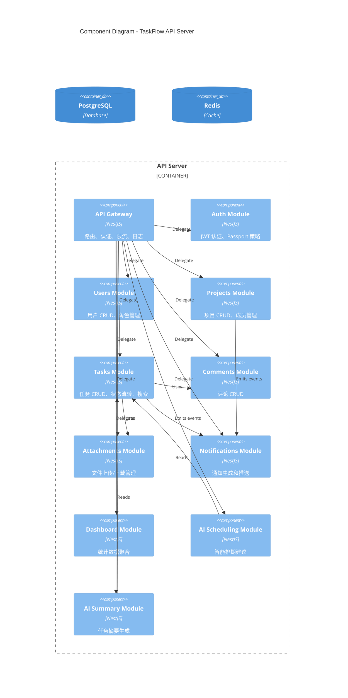

# Architecture: TaskFlow 系统架构设计

<!--
Document: Architecture Design Document
Version: 2.0.0
Author: Solution Architect
Created: 2026-07-11
Status: Approved
-->

## 1. 概述

### 1.1 系统概述

TaskFlow 采用前后端分离的模块化单体架构，按业务领域划分模块，预留微服务拆分接口。前端使用 React + TypeScript 构建 SPA，后端使用 NestJS + TypeScript，数据库采用 PostgreSQL 16，缓存层使用 Redis 7，异步任务通过 BullMQ 处理。

### 1.2 架构风格

| 属性 | 选择 | 原因 |
|------|------|------|
| 架构风格 | 模块化单体（预留微服务拆分） | 初期团队规模小，单体架构开发效率高；模块化设计保证未来可拆分 |
| 通信协议 | REST API（JSON） | 业界标准，前端兼容性好，调试方便 |
| 数据存储 | PostgreSQL 16 + Redis 7 | PostgreSQL 功能全面；Redis 高性能缓存 |
| 部署方式 | Docker + Kubernetes + ArgoCD | 容器化标准化，K8s 编排，GitOps 部署 |
| 前端架构 | SPA (React) + Zustand | 单页应用体验好，Zustand 轻量状态管理 |

### 1.3 架构原则

| 原则 | 说明 |
|------|------|
| 关注点分离 | 前后端分离，模块内高内聚，模块间低耦合 |
| 渐进式拆分 | 单体优先，当模块复杂度或流量增长到需要独立扩展时再拆分 |
| 类型安全 | 全栈 TypeScript，共享类型定义 |
| 防御性编程 | 输入校验、错误处理、降级兜底 |
| 可观测性 | 结构化日志、指标采集、分布式追踪 |

---

## 2. C4 模型架构图

### 2.1 系统上下文图 (Level 1)



### 2.2 容器图 (Level 2)



### 2.3 组件图 (Level 3) - API 模块



---

## 3. 模块设计

### 3.1 模块划分

| 模块 | 职责 | 核心类/服务 | 依赖 |
|------|------|-------------|------|
| AuthModule | 用户注册、登录、密码重置、Token 刷新 | AuthService, JwtStrategy, LocalStrategy | UsersModule, Redis |
| UsersModule | 用户 CRUD、角色管理、个人资料 | UsersService, UsersController | Database |
| ProjectsModule | 项目创建/编辑/归档、成员邀请/移除 | ProjectsService, ProjectsController | UsersModule, NotificationsModule |
| TasksModule | 任务 CRUD、状态流转、优先级、搜索 | TasksService, TasksController | ProjectsModule, UsersModule, NotificationsModule |
| CommentsModule | 任务评论的增删改查 | CommentsService, CommentsController | TasksModule, UsersModule |
| AttachmentsModule | 文件上传/下载、S3 集成 | AttachmentsService, S3Provider | TasksModule, AWS S3 |
| NotificationsModule | 站内通知生成、邮件通知发送 | NotificationsService, EmailService | UsersModule, BullMQ, SendGrid |
| DashboardModule | 项目统计、个人效率分析、燃尽图 | DashboardService, DashboardController | TasksModule, ProjectsModule |
| AISchedulingModule | AI 智能排期建议生成 | AISchedulingService, OpenAIService | TasksModule, UsersModule, ProjectsModule |
| AISummaryModule | AI 任务摘要生成 | AISummaryService, OpenAIService | TasksModule |

### 3.2 模块间通信

```
┌──────────────────────────────────────────────────────────────────┐
│                        模块间通信机制                              │
├──────────────────────────────────────────────────────────────────┤
│                                                                  │
│  同步通信 (方法调用)                                              │
│  ┌─────────┐     ┌─────────┐     ┌─────────┐                    │
│  │ Tasks   │────▶│Comments │     │ Projects│────▶│Notifications│  │
│  │ Module  │     │ Module  │     │ Module  │     │  Module     │  │
│  └─────────┘     └─────────┘     └─────────┘     └─────────────┘  │
│                                                                  │
│  异步通信 (事件驱动)                                              │
│  ┌─────────────┐   EventEmitter   ┌─────────────────────┐        │
│  │ TaskCreated  │───────▶────────│ NotificationsModule  │        │
│  │ TaskUpdated  │                │ (生成通知)            │        │
│  │ TaskAssigned │                │ EmailService         │        │
│  │ CommentAdded │                │ (发送邮件)            │        │
│  └─────────────┘                └─────────────────────┘        │
│                                                                  │
│  异步通信 (消息队列)                                              │
│  ┌─────────────┐     BullMQ      ┌─────────────────────┐        │
│  │ AIScheduling │───────▶────────│ Queue Worker         │        │
│  │ enqueue job  │                │ (处理 AI 调用)        │        │
│  └─────────────┘                └─────────────────────┘        │
│                                                                  │
└──────────────────────────────────────────────────────────────────┘
```

---

## 4. 技术选型

### 4.1 选型理由

| 层次 | 技术 | 版本 | 选型理由 | 替代方案及放弃原因 |
|------|------|------|----------|-------------------|
| 前端框架 | React | 18.x | 生态最丰富，团队已有 3 年 React 经验；社区活跃，第三方库支持完善 | Vue 3：团队不熟悉，学习成本高 |
| 前端语言 | TypeScript | 5.x | 全栈类型安全，前后端共享类型定义，减少接口对接错误 | JavaScript：缺少类型检查，项目规模增大后维护困难 |
| 状态管理 | Zustand | 4.x | 极简 API，无 boilerplate，支持 TypeScript 完美推演；包体积仅 1KB | Redux Toolkit：模板代码过多，对中小项目过重 |
| 服务端状态 | TanStack Query | 5.x | 自动缓存、重新获取、乐观更新，减少手动状态管理 | SWR：功能类似但 TanStack Query 生态更成熟 |
| 后端框架 | NestJS | 10.x | 企业级架构（Module/Controller/Service），内置依赖注入、守卫、拦截器；全栈 TypeScript | Express：过于灵活，缺少架构约束，大项目难维护 |
| ORM | TypeORM | 0.3.x | 支持 Active Record 和 Data Mapper 模式，TypeScript 原生支持，迁移工具完善 | Prisma：DSL 学习成本高，团队偏好 TypeScript 装饰器风格 |
| 数据库 | PostgreSQL | 16 | JSONB 支持灵活数据存储，全文搜索内置，窗口函数强大，ACID 事务保证 | MySQL 8：JSON 支持弱，缺少部分高级 SQL 功能 |
| 缓存 | Redis | 7 | 高性能（10万+ QPS），支持多种数据结构，BullMQ 队列原生支持 | Memcached：功能单一，不支持持久化和复杂数据结构 |
| 消息队列 | BullMQ | 5.x | 基于 Redis，无需额外部署中间件；支持延迟任务、重试、优先级 | RabbitMQ：需额外部署，运维成本高 |
| AI 服务 | OpenAI GPT-4o | - | 业界领先的推理能力，API 稳定，响应速度快 | 开源模型（如 Llama 3）：需自建 GPU 集群，成本高且维护复杂 |
| 邮件服务 | SendGrid | - | 高送达率（99%+），API 简单易用，免费额度满足初期需求 | AWS SES：配置复杂，初版不必要 |
| 文件存储 | AWS S3 | - | 高可用（99.99%），成本低，SDK 成熟 | 自建存储：运维成本高，可靠性不如 S3 |
| CSS 框架 | Tailwind CSS | 3.x | 原子化 CSS，开发效率高，设计系统一致性强 | CSS Modules：需要写更多自定义 CSS |
| UI 组件库 | Radix UI | 1.x | 无样式 UI 原语，完美配合 Tailwind，无障碍 (a11y) 内置 | MUI：组件过于厚重，样式定制困难 |
| 测试框架 | Vitest + Playwright | 1.x | Vitest 与 Vite 完美集成，速度快；Playwright 覆盖所有浏览器 | Jest：对 Vite 支持不够好，配置复杂 |
| 容器化 | Docker | 26.x | 标准化部署，环境一致性 | - |
| 容器编排 | Kubernetes | 1.29 | 自动扩缩容、滚动更新、服务发现 | Docker Swarm：生态不如 K8s |
| CI/CD | GitHub Actions | - | 与 GitHub 仓库深度集成，Marketplace 丰富 | Jenkins：需自建服务器，配置繁琐 |
| GitOps | ArgoCD | 2.x | 声明式部署，自动同步 Git 状态到 K8s 集群 | 手动 kubectl：缺少版本控制和审计 |

---

## 5. 数据流设计

### 5.1 用户请求完整路径

以"创建任务"为例，展示用户请求从入口到响应的完整路径：

```
┌─────────────────────────────────────────────────────────────────────┐
│                    创建任务 - 请求生命周期                            │
├─────────────────────────────────────────────────────────────────────┤
│                                                                     │
│  1. 用户操作                                                         │
│     用户在浏览器填写任务表单（标题、描述、优先级、指派人）              │
│     点击"创建"按钮                                                    │
│                                                                     │
│  2. 前端处理                                                         │
│     ├── React Hook Form 收集表单数据                                 │
│     ├── Zod 客户端校验（标题非空、优先级枚举值合法）                   │
│     ├── TanStack Query mutation 发起 POST /projects/{id}/tasks      │
│     └── 请求头携带 Authorization: Bearer {jwt_token}                 │
│                                                                     │
│  3. 网络传输                                                         │
│     └── HTTPS/TLS 1.3 → Nginx Ingress → API Service (ClusterIP)     │
│                                                                     │
│  4. NestJS 中间件链                                                  │
│     ├── HelmetMiddleware (安全头设置)                                │
│     ├── CorsMiddleware (CORS 校验)                                  │
│     ├── RequestIdMiddleware (生成请求 ID)                            │
│     ├── LoggerMiddleware (请求日志)                                  │
│     └── RateLimitMiddleware (限流检查)                               │
│                                                                     │
│  5. 认证守卫 (JwtAuthGuard)                                          │
│     ├── 从 Authorization 头提取 JWT Token                            │
│     ├── 验证 Token 签名和过期时间                                     │
│     ├── 从 Redis 检查 Token 是否被撤销 (黑名单)                       │
│     └── 解析用户信息 → 注入 Request.user                             │
│                                                                     │
│  6. 权限守卫 (RolesGuard)                                            │
│     ├── 检查用户是否为项目成员                                        │
│     └── 检查用户是否有"创建任务"权限                                  │
│                                                                     │
│  7. 参数校验管道 (ValidationPipe)                                    │
│     ├── 使用 class-validator 校验 DTO                                │
│     ├── 标题长度: 1-500 字符                                         │
│     ├── 优先级: 必须是 urgent/high/medium/low 之一                    │
│     └── assigneeId: 必须是项目成员                                    │
│                                                                     │
│  8. 控制器 (TasksController)                                        │
│     └── @Post() create(@Body() dto: CreateTaskDto, @Req() req)      │
│                                                                     │
│  9. 服务层 (TasksService)                                            │
│     ├── 构建 Task 实体                                               │
│     ├── 调用 TypeORM Repository.save()                              │
│     ├── 数据库 INSERT INTO tasks                                     │
│     ├── 发布事件: TaskCreatedEvent                                   │
│     └── 返回创建的 Task 对象                                         │
│                                                                     │
│  10. 事件处理 (异步)                                                  │
│      ├── NotificationsService 监听 TaskCreatedEvent                  │
│      ├── 生成站内通知："张三 给你分配了一个新任务"                     │
│      ├── 将通知存入 notifications 表                                  │
│      └── 通过 BullMQ 队列异步发送邮件通知                              │
│                                                                     │
│  11. 响应返回                                                        │
│      ├── 序列化响应（排除敏感字段如 password_hash）                    │
│      ├── 包装为标准格式: { code: 0, data: {...}, message: "ok" }     │
│      └── HTTP 201 Created                                            │
│                                                                     │
│  12. 前端更新                                                         │
│      ├── TanStack Query 自动 invalidate 相关查询缓存                  │
│      ├── 任务列表页面自动刷新                                         │
│      └── Toast 提示"任务创建成功"                                     │
│                                                                     │
└─────────────────────────────────────────────────────────────────────┘
```

### 5.2 AI 排期数据流

```
┌─────────────────────────────────────────────────────────────────────┐
│                    智能排期建议 - 数据流                              │
├─────────────────────────────────────────────────────────────────────┤
│                                                                     │
│  用户点击"智能排期"                                                   │
│       │                                                             │
│       ▼                                                             │
│  POST /api/v1/projects/{id}/scheduling/suggest                       │
│       │                                                             │
│       ▼                                                             │
│  AISchedulingService.suggest()                                      │
│       │                                                             │
│       ├── 1. 从 PostgreSQL 查询项目未完成任务                         │
│       ├── 2. 从 PostgreSQL 查询项目成员列表                           │
│       ├── 3. 从 Redis 获取成员当前工作负载缓存                         │
│       │                                                             │
│       ▼                                                             │
│  数据预处理 & Prompt 构建                                            │
│       │                                                             │
│       ├── 脱敏：用 user_id 替代真实姓名                               │
│       ├── 构建 JSON 格式的任务上下文                                  │
│       └── 组装 Prompt (含系统指令 + 任务数据 + 约束条件)               │
│       │                                                             │
│       ▼                                                             │
│  通过 BullMQ 队列异步调用 OpenAI API (避免阻塞请求)                    │
│       │                                                             │
│       ├── Queue: ai-scheduling                                      │
│       ├── 请求体: { model: "gpt-4o", messages: [...], temperature: 0.3 } │
│       └── 超时: 10 秒                                                │
│       │                                                             │
│       ▼                                                             │
│  解析 AI 返回的 JSON 排期方案                                         │
│       │                                                             │
│       ├── 验证 JSON 结构完整性                                       │
│       ├── 验证所有任务都已分配                                        │
│       ├── 验证指派人都是项目成员                                      │
│       └── 验证无日期冲突                                              │
│       │                                                             │
│       ▼                                                             │
│  写入 schedule_plans 表                                              │
│       │                                                             │
│       ├── plan_id: uuid                                             │
│       ├── project_id: uuid                                          │
│       ├── plan_data: JSONB (排期方案详情)                             │
│       ├── status: 'draft'                                           │
│       └── created_by: user_id                                       │
│       │                                                             │
│       ▼                                                             │
│  返回排期方案给前端                                                   │
│       │                                                             │
│       └── 前端渲染甘特图 + 工作负载柱状图                              │
│                                                                     │
│  用户调整后点击"应用方案"                                             │
│       │                                                             │
│       ▼                                                             │
│  PATCH /api/v1/projects/{id}/scheduling/{planId}/apply              │
│       │                                                             │
│       ├── 1. 更新 schedule_plans.status = 'applied'                 │
│       ├── 2. 批量更新 tasks 表 (assignee_id, due_date)               │
│       ├── 3. 发布 TaskBulkUpdatedEvent                              │
│       └── 4. 通知相关成员                                            │
│                                                                     │
└─────────────────────────────────────────────────────────────────────┘
```

---

## 6. 部署架构

### 6.1 环境拓扑

```
┌─────────────────────────────────────────────────────────────────────┐
│                        Kubernetes Cluster                           │
│                                                                     │
│  ┌─────────────────────┐  ┌─────────────────────┐                   │
│  │   Ingress (Nginx)   │  │   ArgoCD            │                   │
│  │   TLS Termination   │  │   GitOps Sync        │                   │
│  └─────────┬───────────┘  └─────────────────────┘                   │
│            │                                                        │
│  ┌─────────▼───────────────────────────────────────┐               │
│  │                 Web Service                      │               │
│  │  ┌──────────────┐  ┌──────────────┐             │               │
│  │  │ Web Pod 1    │  │ Web Pod 2    │  (Replica: 2)              │
│  │  │ Nginx + SPA  │  │ Nginx + SPA  │             │               │
│  │  └──────────────┘  └──────────────┘             │               │
│  └───────────────────────┬─────────────────────────┘               │
│                          │                                          │
│  ┌───────────────────────▼─────────────────────────┐               │
│  │                 API Service                      │               │
│  │  ┌──────────────┐  ┌──────────────┐             │               │
│  │  │ API Pod 1    │  │ API Pod 2    │  (Replica: 3)              │
│  │  │ NestJS       │  │ NestJS       │             │               │
│  │  └──────────────┘  └──────────────┘             │               │
│  └──────────┬──────────────────┬───────────────────┘               │
│             │                  │                                    │
│  ┌──────────▼──────────┐ ┌────▼──────────────┐                     │
│  │   Queue Worker      │ │                    │                     │
│  │  ┌──────────────┐   │ │                    │                     │
│  │  │ Worker Pod 1 │   │ │                    │                     │
│  │  │ BullMQ       │   │ │                    │                     │
│  │  └──────────────┘   │ │                    │                     │
│  └─────────────────────┘ │                    │                     │
│                          │                    │                     │
│  ┌───────────────────────▼────────┐ ┌─────────▼──────────────┐     │
│  │       PostgreSQL 16            │ │     Redis 7             │     │
│  │  ┌──────────────────────────┐  │ │  ┌──────────────────┐   │     │
│  │  │ Primary (StatefulSet)    │  │ │  │ Primary + Sentinel│   │     │
│  │  │ 4 CPU / 16 GB / 100 GB  │  │ │  │ 2 GB memory       │   │     │
│  │  └──────────────────────────┘  │ │  └──────────────────┘   │     │
│  └───────────────────────────────┘ └─────────────────────────┘     │
│                                                                     │
│  ┌───────────────────────────────────────────────────────────────┐ │
│  │                    Monitoring Stack                            │ │
│  │  ┌──────────────┐  ┌──────────────┐  ┌──────────────┐        │ │
│  │  │ Prometheus   │  │ Grafana      │  │ Sentry       │        │ │
│  │  │ Metrics      │  │ Dashboards   │  │ Error Track  │        │ │
│  │  └──────────────┘  └──────────────┘  └──────────────┘        │ │
│  └───────────────────────────────────────────────────────────────┘ │
│                                                                     │
└─────────────────────────────────────────────────────────────────────┘
```

### 6.2 环境配置

| 环境 | 用途 | 数据库 | 资源规格 | 自动扩缩容 |
|------|------|--------|----------|-----------|
| dev | 本地开发 | Docker Compose (PostgreSQL + Redis) | - | - |
| staging | 预发布验证 | 独立 PostgreSQL 实例 | 1 CPU / 1 GB per Pod | 否 |
| production | 生产环境 | 高可用 PostgreSQL (Primary + Read Replica) | 2 CPU / 2 GB per API Pod | 是 (CPU > 70%) |

---

## 7. 非功能需求实现方案

### 7.1 性能优化

| 策略 | 实现方式 | 预期效果 |
|------|----------|----------|
| 数据库查询优化 | 合理索引（覆盖查询）、避免 N+1（TypeORM eager/releation）、查询结果分页 | 单表查询 < 10ms |
| 缓存策略 | Redis 缓存热点数据（用户信息、项目成员列表），TTL 5 分钟 | 缓存命中率 > 80% |
| API 响应压缩 | Nginx gzip 压缩 JSON 响应 | 网络传输量减少 60% |
| 前端代码分割 | React.lazy + Suspense 按路由拆分 | 首屏加载时间 < 2s |
| 数据库连接池 | TypeORM connection pool: min=5, max=20 | 避免连接耗尽 |
| 静态资源 CDN | 前端静态资源通过 CDN 分发 | 全球访问延迟 < 100ms |

### 7.2 安全方案

| 安全措施 | 实现方式 | 防护目标 |
|----------|----------|----------|
| 传输加密 | TLS 1.3，强制 HTTPS | 中间人攻击 |
| 密码存储 | bcrypt (cost factor 12) | 密码泄露 |
| 认证 | JWT (RS256)，24h 过期，Refresh Token 7d | 会话劫持 |
| 授权 | 自定义 RBAC Guards (admin/manager/member) | 越权访问 |
| 输入校验 | class-validator + Zod（前后端双重校验） | SQL 注入、XSS |
| CSRF 防护 | SameSite=Strict Cookie + CSRF Token | CSRF 攻击 |
| 速率限制 | @nestjs/throttler, Redis 存储 | 暴力破解、DDoS |
| SQL 注入防护 | 参数化查询（TypeORM 内置） | SQL 注入 |
| 安全头 | Helmet 中间件 (CSP, HSTS, X-Frame-Options) | XSS, Clickjacking |
| 依赖扫描 | GitHub Dependabot + npm audit | 已知漏洞 |

### 7.3 可扩展性

| 策略 | 说明 |
|------|------|
| 水平扩展 | API Pod 无状态，可任意水平扩展；通过 K8s HPA 自动扩缩容 |
| 数据库扩展 | 读多写少场景使用 Read Replica；未来可考虑分片（按 project_id） |
| 缓存扩展 | Redis Cluster 模式支持分片扩展 |
| 微服务拆分准备 | 模块间通过接口（Interface）通信，可独立部署为微服务 |

---

## 8. 架构决策记录 (ADR)

### 8.1 ADR 清单

| 编号 | 决策 | 日期 | 状态 |
|------|------|------|------|
| ADR-001 | 选择模块化单体架构 | 2026-07-01 | Accepted |
| ADR-002 | 选择 PostgreSQL 作为主数据库 | 2026-07-01 | Accepted |
| ADR-003 | 选择 Zustand 作为前端状态管理 | 2026-07-02 | Accepted |
| ADR-004 | 选择 NestJS 作为后端框架 | 2026-07-02 | Accepted |
| ADR-005 | AI 功能使用 OpenAI API 而非开源模型 | 2026-07-05 | Accepted |
| ADR-006 | 采用 BullMQ 而非 RabbitMQ 作为消息队列 | 2026-07-05 | Accepted |
| ADR-007 | 前端使用 Tailwind CSS + Radix UI 组合 | 2026-07-06 | Accepted |

> 详细的 ADR 记录请参考 [decision-log.md](./decision-log.md)

---

**版本: 2.0.0 | 作者: Solution Architect | 日期: 2026-07-11**