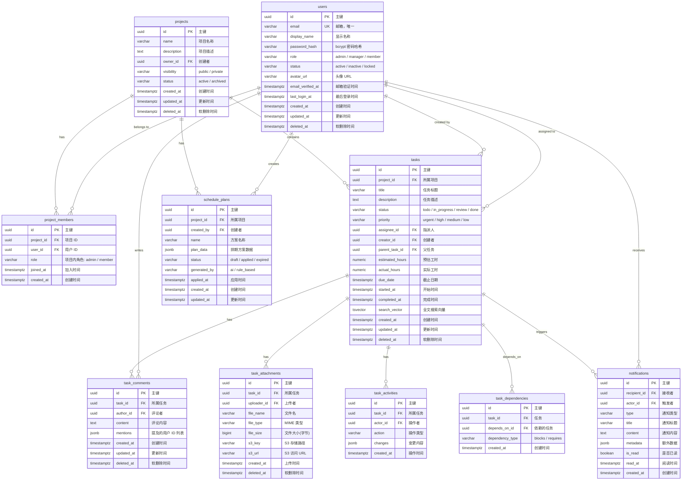

# Database Schema: TaskFlow

<!--
Document: Database Schema
Version: 1.0.0
Author: Database Engineer
Created: 2026-07-11
Updated: 2026-07-11
Status: Approved
-->

## 1. 概述

| 属性 | 值 |
|------|------|
| 数据库系统 | PostgreSQL 16 |
| 数据库名称 | taskflow |
| 字符集 | UTF-8 |
| 排序规则 | en_US.UTF-8 |
| 时区 | UTC |
| ORM | TypeORM 0.3.x |
| 迁移工具 | TypeORM CLI |
| 软删除策略 | deleted_at (TIMESTAMPTZ) |
| 主键策略 | UUID v4 (gen_random_uuid()) |

---

## 2. ER 图



---

## 3. 核心表 DDL

### 3.1 users

```sql
CREATE TABLE users (
    id UUID PRIMARY KEY DEFAULT gen_random_uuid(),
    email VARCHAR(255) NOT NULL,
    display_name VARCHAR(100) NOT NULL,
    password_hash VARCHAR(255) NOT NULL,
    role VARCHAR(50) NOT NULL DEFAULT 'member'
        CHECK (role IN ('admin', 'manager', 'member')),
    status VARCHAR(20) NOT NULL DEFAULT 'active'
        CHECK (status IN ('active', 'inactive', 'locked')),
    avatar_url VARCHAR(500),
    email_verified_at TIMESTAMPTZ,
    last_login_at TIMESTAMPTZ,
    failed_login_attempts INT NOT NULL DEFAULT 0,
    locked_until TIMESTAMPTZ,
    created_at TIMESTAMPTZ NOT NULL DEFAULT NOW(),
    updated_at TIMESTAMPTZ NOT NULL DEFAULT NOW(),
    deleted_at TIMESTAMPTZ
);

-- 约束
ALTER TABLE users ADD CONSTRAINT uq_users_email UNIQUE (email);

-- 索引
CREATE INDEX idx_users_email ON users (email) WHERE deleted_at IS NULL;
CREATE INDEX idx_users_status ON users (status) WHERE deleted_at IS NULL;
CREATE INDEX idx_users_role ON users (role) WHERE deleted_at IS NULL;
```

### 3.2 projects

```sql
CREATE TABLE projects (
    id UUID PRIMARY KEY DEFAULT gen_random_uuid(),
    name VARCHAR(200) NOT NULL,
    description TEXT,
    owner_id UUID NOT NULL REFERENCES users(id),
    visibility VARCHAR(20) NOT NULL DEFAULT 'private'
        CHECK (visibility IN ('public', 'private')),
    status VARCHAR(20) NOT NULL DEFAULT 'active'
        CHECK (status IN ('active', 'archived')),
    created_at TIMESTAMPTZ NOT NULL DEFAULT NOW(),
    updated_at TIMESTAMPTZ NOT NULL DEFAULT NOW(),
    deleted_at TIMESTAMPTZ
);

-- 索引
CREATE INDEX idx_projects_owner ON projects (owner_id) WHERE deleted_at IS NULL;
CREATE INDEX idx_projects_status ON projects (status) WHERE deleted_at IS NULL;
CREATE INDEX idx_projects_visibility ON projects (visibility) WHERE deleted_at IS NULL;
```

### 3.3 project_members

```sql
CREATE TABLE project_members (
    id UUID PRIMARY KEY DEFAULT gen_random_uuid(),
    project_id UUID NOT NULL REFERENCES projects(id) ON DELETE CASCADE,
    user_id UUID NOT NULL REFERENCES users(id) ON DELETE CASCADE,
    role VARCHAR(20) NOT NULL DEFAULT 'member'
        CHECK (role IN ('admin', 'member')),
    joined_at TIMESTAMPTZ NOT NULL DEFAULT NOW(),
    created_at TIMESTAMPTZ NOT NULL DEFAULT NOW(),
    UNIQUE (project_id, user_id)
);

-- 索引
CREATE INDEX idx_project_members_project ON project_members (project_id);
CREATE INDEX idx_project_members_user ON project_members (user_id);
```

### 3.4 tasks

```sql
CREATE TABLE tasks (
    id UUID PRIMARY KEY DEFAULT gen_random_uuid(),
    project_id UUID NOT NULL REFERENCES projects(id),
    title VARCHAR(500) NOT NULL,
    description TEXT,
    status VARCHAR(20) NOT NULL DEFAULT 'todo'
        CHECK (status IN ('todo', 'in_progress', 'review', 'done')),
    priority VARCHAR(20) NOT NULL DEFAULT 'medium'
        CHECK (priority IN ('urgent', 'high', 'medium', 'low')),
    assignee_id UUID REFERENCES users(id),
    creator_id UUID NOT NULL REFERENCES users(id),
    parent_task_id UUID REFERENCES tasks(id),
    estimated_hours NUMERIC(5,1) CHECK (estimated_hours > 0 AND estimated_hours <= 160),
    actual_hours NUMERIC(5,1) CHECK (actual_hours >= 0),
    due_date TIMESTAMPTZ,
    started_at TIMESTAMPTZ,
    completed_at TIMESTAMPTZ,
    search_vector TSVECTOR,
    created_at TIMESTAMPTZ NOT NULL DEFAULT NOW(),
    updated_at TIMESTAMPTZ NOT NULL DEFAULT NOW(),
    deleted_at TIMESTAMPTZ
);

-- 约束
ALTER TABLE tasks ADD CONSTRAINT chk_tasks_due_date_future
    CHECK (due_date IS NULL OR due_date > created_at);

-- 索引
CREATE INDEX idx_tasks_project ON tasks (project_id) WHERE deleted_at IS NULL;
CREATE INDEX idx_tasks_assignee ON tasks (assignee_id) WHERE deleted_at IS NULL;
CREATE INDEX idx_tasks_creator ON tasks (creator_id) WHERE deleted_at IS NULL;
CREATE INDEX idx_tasks_status ON tasks (status) WHERE deleted_at IS NULL;
CREATE INDEX idx_tasks_priority ON tasks (priority) WHERE deleted_at IS NULL;
CREATE INDEX idx_tasks_due_date ON tasks (due_date) WHERE deleted_at IS NULL;
CREATE INDEX idx_tasks_parent ON tasks (parent_task_id) WHERE deleted_at IS NULL;

-- 全文搜索索引
CREATE INDEX idx_tasks_search ON tasks USING GIN (search_vector);
```

### 3.5 task_comments

```sql
CREATE TABLE task_comments (
    id UUID PRIMARY KEY DEFAULT gen_random_uuid(),
    task_id UUID NOT NULL REFERENCES tasks(id) ON DELETE CASCADE,
    author_id UUID NOT NULL REFERENCES users(id),
    content TEXT NOT NULL CHECK (char_length(content) <= 5000),
    mentions JSONB DEFAULT '[]'::jsonb,
    created_at TIMESTAMPTZ NOT NULL DEFAULT NOW(),
    updated_at TIMESTAMPTZ NOT NULL DEFAULT NOW(),
    deleted_at TIMESTAMPTZ
);

-- 索引
CREATE INDEX idx_task_comments_task ON task_comments (task_id) WHERE deleted_at IS NULL;
CREATE INDEX idx_task_comments_author ON task_comments (author_id) WHERE deleted_at IS NULL;
```

### 3.6 task_attachments

```sql
CREATE TABLE task_attachments (
    id UUID PRIMARY KEY DEFAULT gen_random_uuid(),
    task_id UUID NOT NULL REFERENCES tasks(id) ON DELETE CASCADE,
    uploader_id UUID NOT NULL REFERENCES users(id),
    file_name VARCHAR(255) NOT NULL,
    file_type VARCHAR(100) NOT NULL,
    file_size BIGINT NOT NULL CHECK (file_size > 0 AND file_size <= 52428800), -- 50 MB max
    s3_key VARCHAR(500) NOT NULL,
    s3_url VARCHAR(1000) NOT NULL,
    created_at TIMESTAMPTZ NOT NULL DEFAULT NOW(),
    deleted_at TIMESTAMPTZ
);

-- 索引
CREATE INDEX idx_task_attachments_task ON task_attachments (task_id) WHERE deleted_at IS NULL;
```

### 3.7 task_activities

```sql
CREATE TABLE task_activities (
    id UUID PRIMARY KEY DEFAULT gen_random_uuid(),
    task_id UUID NOT NULL REFERENCES tasks(id) ON DELETE CASCADE,
    actor_id UUID NOT NULL REFERENCES users(id),
    action VARCHAR(50) NOT NULL,
    changes JSONB,
    created_at TIMESTAMPTZ NOT NULL DEFAULT NOW()
);

-- 索引
CREATE INDEX idx_task_activities_task ON task_activities (task_id);
CREATE INDEX idx_task_activities_created ON task_activities (created_at DESC);
```

### 3.8 task_dependencies

```sql
CREATE TABLE task_dependencies (
    id UUID PRIMARY KEY DEFAULT gen_random_uuid(),
    task_id UUID NOT NULL REFERENCES tasks(id) ON DELETE CASCADE,
    depends_on_id UUID NOT NULL REFERENCES tasks(id) ON DELETE CASCADE,
    dependency_type VARCHAR(20) NOT NULL DEFAULT 'blocks'
        CHECK (dependency_type IN ('blocks', 'requires')),
    created_at TIMESTAMPTZ NOT NULL DEFAULT NOW(),
    UNIQUE (task_id, depends_on_id),
    CHECK (task_id <> depends_on_id)
);

-- 索引
CREATE INDEX idx_task_dependencies_task ON task_dependencies (task_id);
CREATE INDEX idx_task_dependencies_depends ON task_dependencies (depends_on_id);
```

### 3.9 notifications

```sql
CREATE TABLE notifications (
    id UUID PRIMARY KEY DEFAULT gen_random_uuid(),
    recipient_id UUID NOT NULL REFERENCES users(id),
    actor_id UUID REFERENCES users(id),
    type VARCHAR(50) NOT NULL,
    title VARCHAR(200) NOT NULL,
    content TEXT,
    metadata JSONB DEFAULT '{}'::jsonb,
    is_read BOOLEAN NOT NULL DEFAULT FALSE,
    read_at TIMESTAMPTZ,
    created_at TIMESTAMPTZ NOT NULL DEFAULT NOW()
);

-- 索引
CREATE INDEX idx_notifications_recipient ON notifications (recipient_id, is_read, created_at DESC);
CREATE INDEX idx_notifications_unread ON notifications (recipient_id) WHERE is_read = FALSE;
```

### 3.10 schedule_plans

```sql
CREATE TABLE schedule_plans (
    id UUID PRIMARY KEY DEFAULT gen_random_uuid(),
    project_id UUID NOT NULL REFERENCES projects(id),
    created_by UUID NOT NULL REFERENCES users(id),
    name VARCHAR(200) NOT NULL,
    plan_data JSONB NOT NULL,
    status VARCHAR(20) NOT NULL DEFAULT 'draft'
        CHECK (status IN ('draft', 'applied', 'expired')),
    generated_by VARCHAR(20) NOT NULL DEFAULT 'ai'
        CHECK (generated_by IN ('ai', 'rule_based')),
    applied_at TIMESTAMPTZ,
    created_at TIMESTAMPTZ NOT NULL DEFAULT NOW(),
    updated_at TIMESTAMPTZ NOT NULL DEFAULT NOW()
);

-- 索引
CREATE INDEX idx_schedule_plans_project ON schedule_plans (project_id, status);
CREATE INDEX idx_schedule_plans_creator ON schedule_plans (created_by);
```

---

## 4. 索引策略

### 4.1 索引设计原则

| 原则 | 说明 | 示例 |
|------|------|------|
| 覆盖高频查询 | 为 WHERE 条件中的字段创建索引 | `idx_tasks_status` |
| 复合索引优化 | 多列组合查询使用复合索引，遵循最左前缀原则 | `idx_notifications_recipient (recipient_id, is_read, created_at DESC)` |
| 部分索引减少空间 | 使用 WHERE 子句仅索引活跃记录 | `WHERE deleted_at IS NULL` |
| 全文搜索 | 使用 PostgreSQL GIN 索引加速全文搜索 | `idx_tasks_search USING GIN (search_vector)` |
| 外键索引 | 所有外键列创建索引，加速 JOIN 操作 | `idx_tasks_project ON tasks (project_id)` |

### 4.2 全文搜索配置

```sql
-- 创建搜索向量更新触发器
CREATE OR REPLACE FUNCTION update_task_search_vector()
RETURNS TRIGGER AS $$
BEGIN
    NEW.search_vector :=
        setweight(to_tsvector('english', COALESCE(NEW.title, '')), 'A') ||
        setweight(to_tsvector('english', COALESCE(NEW.description, '')), 'B');
    RETURN NEW;
END;
$$ LANGUAGE plpgsql;

CREATE TRIGGER trg_task_search_vector
    BEFORE INSERT OR UPDATE ON tasks
    FOR EACH ROW
    EXECUTE FUNCTION update_task_search_vector();

-- 搜索查询示例
SELECT * FROM tasks
WHERE search_vector @@ plainto_tsquery('english', 'login page design')
  AND deleted_at IS NULL
ORDER BY ts_rank(search_vector, plainto_tsquery('english', 'login page design')) DESC
LIMIT 20;
```

---

## 5. 审计字段规范

### 5.1 标准审计字段

所有核心业务表必须包含以下审计字段：

| 字段 | 类型 | 约束 | 说明 |
|------|------|------|------|
| created_at | TIMESTAMPTZ | NOT NULL DEFAULT NOW() | 记录创建时间，不可变 |
| updated_at | TIMESTAMPTZ | NOT NULL DEFAULT NOW() | 记录最后更新时间，每次 UPDATE 自动更新 |
| deleted_at | TIMESTAMPTZ | NULL | 软删除标记，非 NULL 表示已删除 |

### 5.2 自动更新触发器

```sql
-- 自动更新 updated_at 触发器函数
CREATE OR REPLACE FUNCTION update_updated_at_column()
RETURNS TRIGGER AS $$
BEGIN
    NEW.updated_at = NOW();
    RETURN NEW;
END;
$$ LANGUAGE plpgsql;

-- 为所有核心表创建触发器
CREATE TRIGGER trg_users_updated_at
    BEFORE UPDATE ON users
    FOR EACH ROW EXECUTE FUNCTION update_updated_at_column();

CREATE TRIGGER trg_projects_updated_at
    BEFORE UPDATE ON projects
    FOR EACH ROW EXECUTE FUNCTION update_updated_at_column();

CREATE TRIGGER trg_tasks_updated_at
    BEFORE UPDATE ON tasks
    FOR EACH ROW EXECUTE FUNCTION update_updated_at_column();

CREATE TRIGGER trg_task_comments_updated_at
    BEFORE UPDATE ON task_comments
    FOR EACH ROW EXECUTE FUNCTION update_updated_at_column();

CREATE TRIGGER trg_schedule_plans_updated_at
    BEFORE UPDATE ON schedule_plans
    FOR EACH ROW EXECUTE FUNCTION update_updated_at_column();
```

### 5.3 软删除规范

- 所有 DELETE 操作实际执行 `UPDATE SET deleted_at = NOW()`
- 所有 SELECT 查询默认添加 `WHERE deleted_at IS NULL`
- TypeORM 全局订阅者自动处理软删除逻辑
- 定期清理 `deleted_at < NOW() - INTERVAL '30 days'` 的数据

```sql
-- 定期清理任务（每天凌晨 3 点）
CREATE OR REPLACE FUNCTION cleanup_soft_deleted_records()
RETURNS void AS $$
BEGIN
    DELETE FROM task_attachments WHERE deleted_at < NOW() - INTERVAL '30 days';
    DELETE FROM task_comments WHERE deleted_at < NOW() - INTERVAL '30 days';
    DELETE FROM task_activities WHERE task_id IN (
        SELECT id FROM tasks WHERE deleted_at < NOW() - INTERVAL '30 days'
    );
    DELETE FROM tasks WHERE deleted_at < NOW() - INTERVAL '30 days';
    DELETE FROM project_members WHERE project_id IN (
        SELECT id FROM projects WHERE deleted_at < NOW() - INTERVAL '30 days'
    );
    DELETE FROM projects WHERE deleted_at < NOW() - INTERVAL '30 days';
    DELETE FROM users WHERE deleted_at < NOW() - INTERVAL '30 days';
END;
$$ LANGUAGE plpgsql;

-- 使用 pg_cron 调度
SELECT cron.schedule('cleanup-soft-deleted', '0 3 * * *', 'SELECT cleanup_soft_deleted_records();');
```

---

## 6. 迁移策略

### 6.1 迁移规范

| 规范 | 说明 |
|------|------|
| 迁移文件命名 | `{timestamp}-{description}.ts`，如 `1689000000000-create-tasks-table.ts` |
| 每次迁移一条变更 | 一个迁移文件只做一件事，便于回滚 |
| 迁移必须可逆 | 每个 `up()` 必须有对应的 `down()` |
| 禁止修改已应用的迁移 | 已合并到主分支的迁移文件不可修改，新的变更创建新迁移 |
| 迁移前备份 | 生产环境迁移前必须备份数据库 |

### 6.2 迁移示例: V1.0.0 → V1.1.0

```typescript
// 1720000000000-add-task-dependencies.ts
import { MigrationInterface, QueryRunner, Table } from 'typeorm';

export class AddTaskDependencies1720000000000 implements MigrationInterface {
    name = 'AddTaskDependencies1720000000000';

    public async up(queryRunner: QueryRunner): Promise<void> {
        // 1. 创建 task_dependencies 表
        await queryRunner.createTable(
            new Table({
                name: 'task_dependencies',
                columns: [
                    {
                        name: 'id',
                        type: 'uuid',
                        isPrimary: true,
                        default: 'gen_random_uuid()',
                    },
                    {
                        name: 'task_id',
                        type: 'uuid',
                        isNullable: false,
                    },
                    {
                        name: 'depends_on_id',
                        type: 'uuid',
                        isNullable: false,
                    },
                    {
                        name: 'dependency_type',
                        type: 'varchar',
                        length: '20',
                        default: "'blocks'",
                    },
                    {
                        name: 'created_at',
                        type: 'timestamptz',
                        default: 'NOW()',
                    },
                ],
                foreignKeys: [
                    {
                        name: 'fk_task_dependencies_task',
                        columnNames: ['task_id'],
                        referencedTableName: 'tasks',
                        referencedColumnNames: ['id'],
                        onDelete: 'CASCADE',
                    },
                    {
                        name: 'fk_task_dependencies_depends_on',
                        columnNames: ['depends_on_id'],
                        referencedTableName: 'tasks',
                        referencedColumnNames: ['id'],
                        onDelete: 'CASCADE',
                    },
                ],
                uniques: [
                    {
                        name: 'uq_task_dependencies',
                        columnNames: ['task_id', 'depends_on_id'],
                    },
                ],
            }),
            true
        );

        // 2. 添加约束防止自引用
        await queryRunner.query(`
            ALTER TABLE task_dependencies
            ADD CONSTRAINT chk_no_self_dependency
            CHECK (task_id <> depends_on_id)
        `);

        // 3. 创建索引
        await queryRunner.query(`
            CREATE INDEX idx_task_dependencies_task ON task_dependencies (task_id)
        `);
        await queryRunner.query(`
            CREATE INDEX idx_task_dependencies_depends ON task_dependencies (depends_on_id)
        `);
    }

    public async down(queryRunner: QueryRunner): Promise<void> {
        await queryRunner.dropTable('task_dependencies');
    }
}
```

### 6.3 种子数据

```typescript
// seed.ts - 开发环境种子数据
// 运行: pnpm run seed

import { DataSource } from 'typeorm';
import * as bcrypt from 'bcrypt';

export async function seed(dataSource: DataSource) {
    const queryRunner = dataSource.createQueryRunner();

    // 创建演示用户
    await queryRunner.query(`
        INSERT INTO users (id, email, display_name, password_hash, role, status)
        VALUES
            ('00000000-0000-0000-0000-000000000001', 'admin@taskflow.com', 'Admin User',
             '${await bcrypt.hash('Admin123!', 12)}', 'admin', 'active'),
            ('00000000-0000-0000-0000-000000000002', 'pm@taskflow.com', 'Zhang Wei',
             '${await bcrypt.hash('Pm123456!', 12)}', 'manager', 'active'),
            ('00000000-0000-0000-0000-000000000003', 'dev@taskflow.com', 'Jane Smith',
             '${await bcrypt.hash('Dev123456!', 12)}', 'member', 'active')
    `);

    // 创建演示项目
    await queryRunner.query(`
        INSERT INTO projects (id, name, description, owner_id, visibility)
        VALUES
            ('10000000-0000-0000-0000-000000000001', 'TaskFlow V2.0 开发',
             'TaskFlow 第二版本开发项目，包含智能排期功能',
             '00000000-0000-0000-0000-000000000002', 'private')
    `);

    // 添加项目成员
    await queryRunner.query(`
        INSERT INTO project_members (project_id, user_id, role)
        VALUES
            ('10000000-0000-0000-0000-000000000001', '00000000-0000-0000-0000-000000000001', 'admin'),
            ('10000000-0000-0000-0000-000000000001', '00000000-0000-0000-0000-000000000002', 'admin'),
            ('10000000-0000-0000-0000-000000000001', '00000000-0000-0000-0000-000000000003', 'member')
    `);

    console.log('Seed data inserted successfully');
}
```

---

## 7. 性能优化建议

### 7.1 查询优化

| 场景 | 优化策略 | 预期效果 |
|------|----------|----------|
| 任务列表查询 | 使用覆盖索引避免回表 | 减少 I/O 50% |
| 全文搜索 | 使用 GIN 索引 + ts_rank 排序 | 搜索响应 < 50ms |
| 项目统计 | 使用物化视图预计算 | 统计查询 < 100ms |
| 评论列表 | 使用游标分页替代 OFFSET | 深分页性能稳定 |
| 通知查询 | 未读通知使用部分索引 | 查询 < 10ms |

### 7.2 物化视图示例

```sql
-- 项目统计物化视图（每 5 分钟刷新一次）
CREATE MATERIALIZED VIEW mv_project_statistics AS
SELECT
    p.id AS project_id,
    COUNT(t.id) FILTER (WHERE t.deleted_at IS NULL) AS total_tasks,
    COUNT(t.id) FILTER (WHERE t.status = 'done' AND t.deleted_at IS NULL) AS completed_tasks,
    COUNT(t.id) FILTER (WHERE t.status = 'in_progress' AND t.deleted_at IS NULL) AS in_progress_tasks,
    ROUND(
        COUNT(t.id) FILTER (WHERE t.status = 'done' AND t.deleted_at IS NULL) * 100.0 /
        NULLIF(COUNT(t.id) FILTER (WHERE t.deleted_at IS NULL), 0), 1
    ) AS completion_rate,
    AVG(t.actual_hours) FILTER (WHERE t.status = 'done' AND t.deleted_at IS NULL) AS avg_completion_hours
FROM projects p
LEFT JOIN tasks t ON p.id = t.project_id
WHERE p.deleted_at IS NULL
GROUP BY p.id;

CREATE UNIQUE INDEX idx_mv_project_stats ON mv_project_statistics (project_id);

-- 刷新语句
REFRESH MATERIALIZED VIEW CONCURRENTLY mv_project_statistics;
```

---

**版本: 1.0.0 | 作者: Database Engineer | 日期: 2026-07-11**