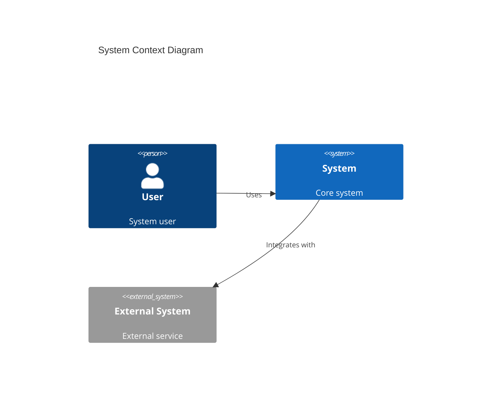
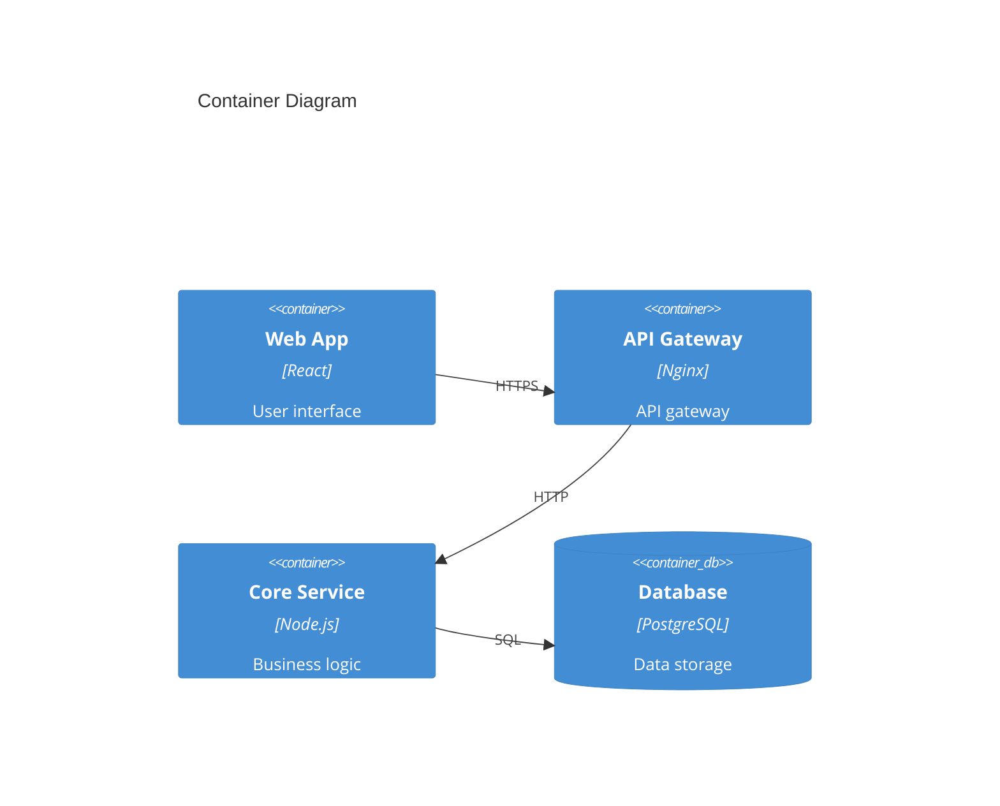
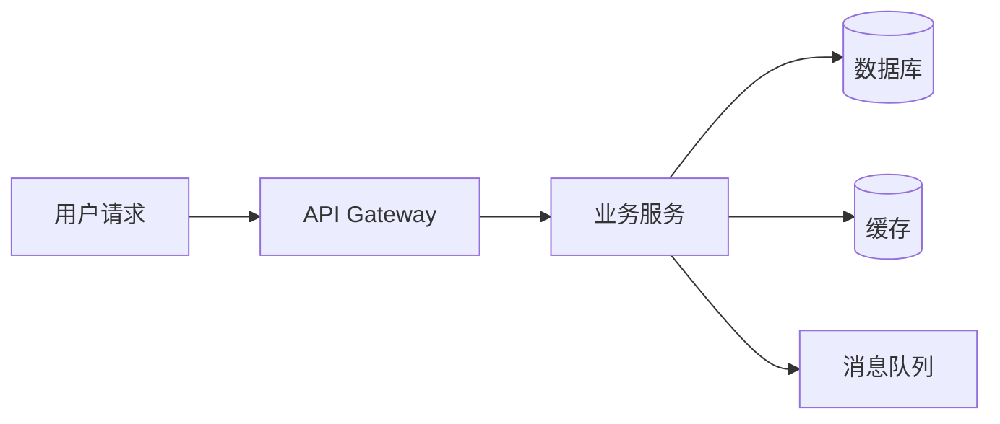
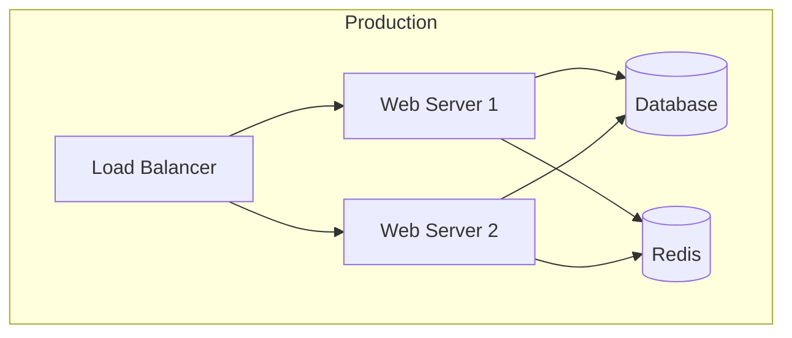
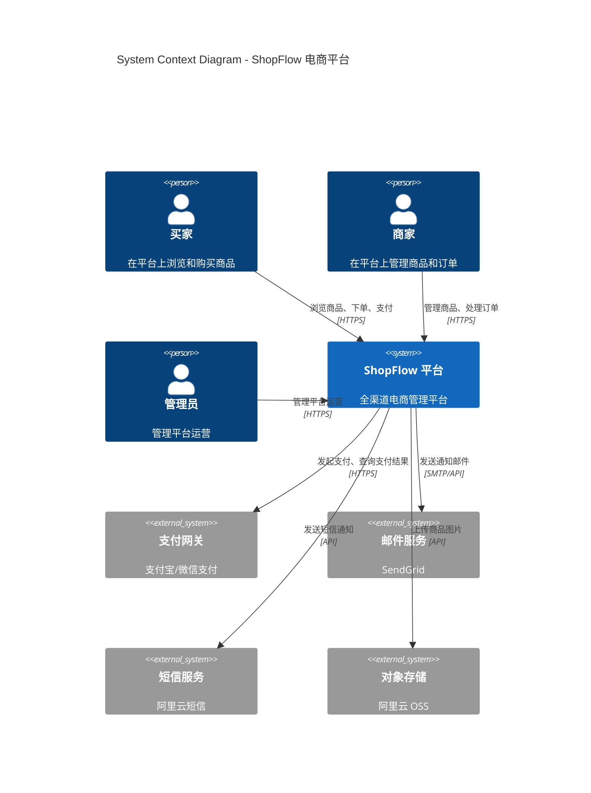
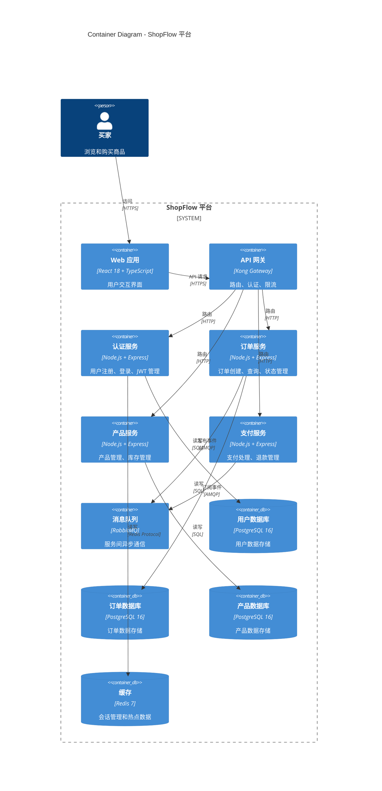
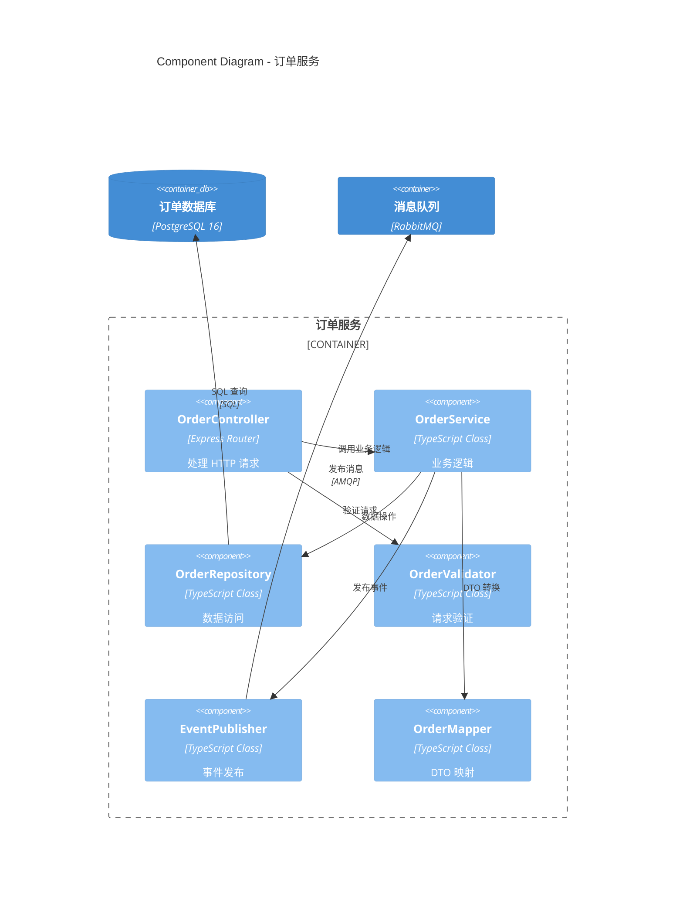
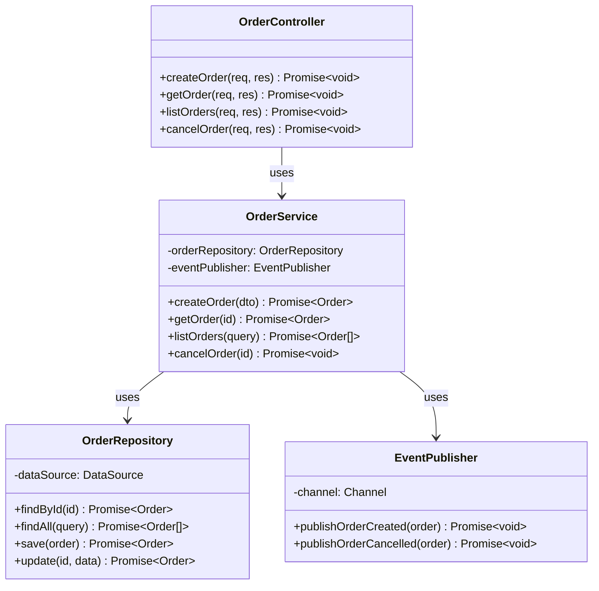

# Architecture Template - 架构文档模板

## 使用说明

本模板用于 Solution Architect 编写架构设计文档。请完整填写所有章节。

## 文档元信息

<!--
Document: Architecture Design Document
Version: 1.0.0
Author: Solution Architect
Created: {YYYY-MM-DD}
Updated: {YYYY-MM-DD}
Status: Draft
-->

---

# Architecture: {系统名称}

## 1. 概述

### 1.1 文档目的

{描述本文档的目的}

### 1.2 系统概述

{系统的一句话概述}

### 1.3 关键需求

| 需求 | 类型 | 优先级 |
|------|------|--------|
| {需求 1} | 功能/非功能 | P0 |
| {需求 2} | 功能/非功能 | P1 |

## 2. 架构设计

### 2.1 系统上下文



### 2.2 容器架构



### 2.3 架构风格

| 属性 | 选择 |
|------|------|
| 架构风格 | {微服务/单体/Serverless/Event-Driven} |
| 通信协议 | {REST/gRPC/GraphQL/消息队列} |
| 数据存储 | {关系型/NoSQL/混合} |
| 部署方式 | {容器化/Serverless/传统} |

## 3. 模块设计

### 3.1 模块划分

| 模块 | 职责 | 技术栈 | 依赖 |
|------|------|--------|------|
| {模块 1} | {职责} | {技术栈} | {依赖} |
| {模块 2} | {职责} | {技术栈} | {依赖} |

### 3.2 模块 1: {模块名称}

#### 3.2.1 职责

{模块的详细职责描述}

#### 3.2.2 接口

| 接口 | 方法 | 路径 | 描述 |
|------|------|------|------|
| {接口 1} | GET/POST | {路径} | {描述} |
| {接口 2} | GET/POST | {路径} | {描述} |

#### 3.2.3 依赖

| 依赖 | 类型 | 用途 |
|------|------|------|
| {依赖 1} | {内部/外部} | {用途} |

## 4. 技术选型

### 4.1 技术栈

| 层次 | 技术 | 版本 | 选型理由 |
|------|------|------|----------|
| 前端 | {React/Vue/Angular} | {版本} | {理由} |
| 后端 | {Node.js/Python/Java/Go} | {版本} | {理由} |
| 数据库 | {PostgreSQL/MySQL/MongoDB} | {版本} | {理由} |
| 缓存 | {Redis/Memcached} | {版本} | {理由} |
| 消息队列 | {RabbitMQ/Kafka/SQS} | {版本} | {理由} |
| 容器化 | {Docker/K8s} | {版本} | {理由} |
| CI/CD | {GitHub Actions/Jenkins} | {版本} | {理由} |

### 4.2 技术决策

| 决策编号 | 决策 | 理由 |
|----------|------|------|
| {DEC-001} | {决策} | {理由} |
| {DEC-002} | {决策} | {理由} |

## 5. 数据架构

### 5.1 数据存储

| 数据 | 存储 | 理由 |
|------|------|------|
| {数据 1} | {PostgreSQL/Redis/S3} | {理由} |
| {数据 2} | {PostgreSQL/Redis/S3} | {理由} |

### 5.2 数据流



## 6. 安全架构

### 6.1 认证授权

| 方面 | 方案 |
|------|------|
| 认证方式 | {JWT/OAuth2/Session} |
| 授权模型 | {RBAC/ABAC} |
| Token 管理 | {方案} |

### 6.2 安全措施

| 措施 | 说明 |
|------|------|
| 传输加密 | TLS 1.3 |
| 数据加密 | AES-256 |
| 输入验证 | {方案} |
| 速率限制 | {方案} |
| CORS | {配置} |

## 7. 非功能架构

### 7.1 性能

| 策略 | 说明 |
|------|------|
| 缓存策略 | {多级缓存策略} |
| 数据库优化 | {索引/连接池/读写分离} |
| 异步处理 | {消息队列/后台任务} |

### 7.2 可扩展性

| 策略 | 说明 |
|------|------|
| 水平扩展 | {无状态设计/负载均衡} |
| 数据分区 | {分库分表/Sharding} |

### 7.3 可靠性

| 策略 | 说明 |
|------|------|
| 容错 | {重试/降级/熔断} |
| 备份 | {备份策略} |
| 监控 | {监控方案} |

## 8. 部署架构

### 8.1 部署拓扑



### 8.2 基础设施

| 资源 | 规格 | 数量 |
|------|------|------|
| Web Server | {CPU/Memory} | {数量} |
| Database | {CPU/Memory/Storage} | {数量} |
| Cache | {Memory} | {数量} |

## 9. 附录

### 9.1 架构决策记录

参见 `docs/决策日志.md`

### 9.2 参考文档

| 文档 | 链接 |
|------|------|
| PRD | {链接} |
| API Spec | {链接} |

### 9.3 变更历史

| 版本 | 日期 | 变更说明 | 作者 |
|------|------|----------|------|
| 1.0.0 | {YYYY-MM-DD} | 初始版本 | Solution Architect |

---

## C4 模型各层级模板

### 第 1 层：系统上下文图（System Context）

展示系统与外部用户和系统的交互关系：



### 第 2 层：容器图（Container Diagram）

展示系统内部的主要容器（应用、数据库、文件系统等）：



### 第 3 层：组件图（Component Diagram）

展示单个容器内部的组件结构：



### 第 4 层：代码图（Code Diagram）

展示关键类或接口的详细设计（使用 UML 类图）：



## 技术选型决策矩阵

### 决策矩阵模板

当需要在多个技术方案之间选择时，使用以下矩阵进行结构化比较：

```markdown
## 技术选型决策矩阵: {决策主题}

### 评估维度

| 维度 | 权重 | 说明 |
|------|------|------|
| 功能匹配度 | 25% | 技术方案是否满足功能需求 |
| 性能 | 20% | 性能指标是否满足要求 |
| 团队经验 | 20% | 团队对该技术的熟悉程度 |
| 社区活跃度 | 15% | 社区支持、文档质量、问题解决速度 |
| 运维复杂度 | 10% | 部署、监控、维护的复杂度 |
| 成本 | 10% | 许可证费用、基础设施成本 |

### 候选方案评分

| 方案 | 功能匹配 | 性能 | 团队经验 | 社区活跃 | 运维复杂度 | 成本 | 加权总分 |
|------|----------|------|----------|----------|------------|------|----------|
| 方案 A | 8 | 7 | 9 | 8 | 8 | 9 | 8.05 |
| 方案 B | 9 | 9 | 6 | 9 | 7 | 8 | 8.10 |
| 方案 C | 7 | 8 | 8 | 7 | 9 | 9 | 7.85 |

**评分标准**: 1-10 分，10 分为最优

### 决策结论

选择方案 B，理由：功能匹配度和性能最优，虽然团队经验分较低，但可以通过培训弥补。
```

### 实际示例：消息队列选型

```markdown
## 技术选型决策矩阵: 消息队列选型

### 评估维度

| 维度 | 权重 | 说明 |
|------|------|------|
| 功能匹配度 | 25% | 是否支持所需的消息模式（发布/订阅、延迟消息、死信队列） |
| 性能 | 20% | 消息吞吐量、延迟 |
| 团队经验 | 20% | 团队对消息队列的熟悉程度 |
| 社区活跃度 | 15% | 社区支持、文档质量、问题解决速度 |
| 运维复杂度 | 10% | 部署、集群管理、监控的复杂度 |
| 成本 | 10% | 许可证费用、基础设施成本 |

### 候选方案评分

| 方案 | 功能匹配 | 性能 | 团队经验 | 社区活跃 | 运维复杂度 | 成本 | 加权总分 |
|------|----------|------|----------|----------|------------|------|----------|
| RabbitMQ | 9 | 8 | 7 | 9 | 7 | 9 | 8.15 |
| Apache Kafka | 8 | 10 | 5 | 9 | 5 | 8 | 7.65 |
| AWS SQS | 7 | 8 | 8 | 8 | 9 | 6 | 7.55 |
| Redis Streams | 6 | 9 | 9 | 8 | 9 | 9 | 7.95 |

**决策结论**: 选择 RabbitMQ，功能和社区支持最优，团队有一定的使用经验，运维复杂度在可接受范围内。
```

## 架构评审清单

### 架构设计评审检查清单

在进行架构评审时，需要检查以下各个方面：

#### 1. 需求对齐

- [ ] 架构设计是否覆盖了 PRD 中定义的所有功能需求
- [ ] 架构设计是否满足非功能需求（性能、安全、可用性、可扩展性）
- [ ] 是否考虑了对未来需求的扩展性（6 个月内可预见的变更）

#### 2. 架构合理性

- [ ] 架构风格选择是否合理（微服务/单体/Serverless）
- [ ] 模块划分是否清晰，职责是否单一
- [ ] 模块间依赖关系是否合理，是否存在循环依赖
- [ ] 接口定义是否清晰，边界是否明确
- [ ] 数据流设计是否合理

#### 3. 技术选型

- [ ] 技术选型是否有充分的理由（不是"因为流行"）
- [ ] 是否考虑了替代方案，并记录了放弃原因
- [ ] 技术栈是否与团队技能匹配
- [ ] 技术栈的许可证是否合规
- [ ] 技术栈的生命周期是否足够长（不会被快速淘汰）

#### 4. 安全性

- [ ] 认证和授权方案是否合理
- [ ] 数据传输是否加密（TLS 1.3）
- [ ] 敏感数据是否加密存储
- [ ] 是否考虑了常见安全威胁（OWASP Top 10）
- [ ] 是否实施了最小权限原则

#### 5. 性能

- [ ] 是否识别了性能瓶颈点
- [ ] 是否设计了缓存策略
- [ ] 是否考虑了数据库查询性能（索引、连接池）
- [ ] 是否设计了异步处理方案（耗时操作）
- [ ] 是否定义了性能指标和监控方案

#### 6. 可用性

- [ ] 是否设计了故障恢复方案
- [ ] 是否考虑了单点故障（SPOF）
- [ ] 是否设计了健康检查和监控方案
- [ ] 是否定义了可用性指标（SLA）

#### 7. 可扩展性

- [ ] 是否支持水平扩展
- [ ] 是否考虑了数据量增长的应对方案
- [ ] 是否考虑了用户量增长的应对方案

#### 8. 可维护性

- [ ] 架构是否足够简单，不过度设计
- [ ] 是否考虑了日志和监控方案
- [ ] 是否考虑了部署和运维方案
- [ ] 是否编写了架构决策记录（ADR）

#### 9. 文档完整性

- [ ] 架构文档是否包含所有必要章节
- [ ] 图表是否清晰、完整
- [ ] 技术决策是否有记录
- [ ] 是否包含了部署架构图

**本模板必须完整填写。不要使用占位符、省略号或 TODO 标记。**