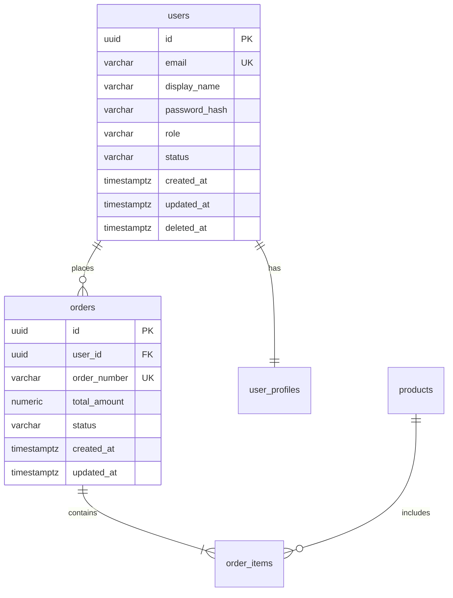
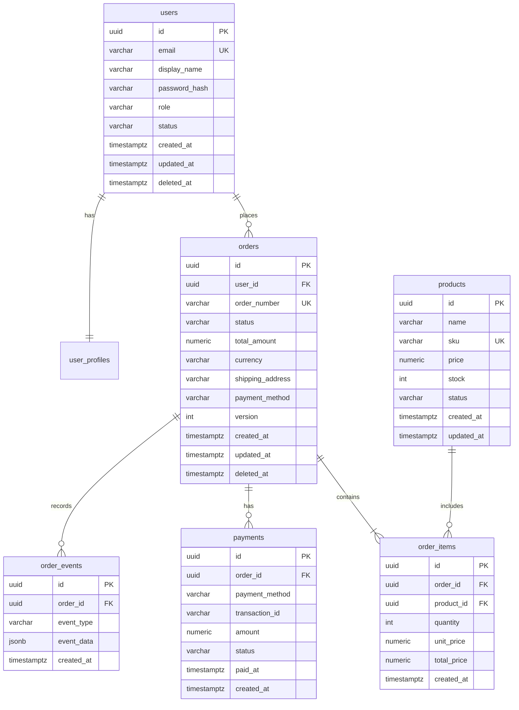

# Database Template - 数据库文档模板

## 使用说明

本模板用于 Database Engineer 编写数据库 Schema 文档。请完整填写所有章节。

## 文档元信息

<!--
Document: Database Schema
Version: 1.0.0
Author: Database Engineer
Created: {YYYY-MM-DD}
Updated: {YYYY-MM-DD}
Status: Draft
-->

---

# Database Schema: {数据库名称}

## 1. 概述

### 1.1 基本信息

| 属性 | 值 |
|------|------|
| 数据库系统 | PostgreSQL 16 |
| 数据库名称 | {database_name} |
| 字符集 | UTF-8 |
| 时区 | UTC |
| Schema | public |

### 1.2 ER 图



## 2. 表定义

### 2.1 表: {table_name}

#### 2.1.1 表描述

{表的用途和描述}

#### 2.1.2 列定义

| 列名 | 类型 | 约束 | 默认值 | 说明 |
|------|------|------|--------|------|
| id | UUID | PK, NOT NULL | gen_random_uuid() | 主键 |
| name | VARCHAR(100) | NOT NULL | - | 名称 |
| status | VARCHAR(20) | NOT NULL | 'active' | 状态 |
| created_at | TIMESTAMPTZ | NOT NULL | NOW() | 创建时间 |
| updated_at | TIMESTAMPTZ | NOT NULL | NOW() | 更新时间 |
| deleted_at | TIMESTAMPTZ | - | NULL | 软删除时间 |

#### 2.1.3 索引

| 索引名 | 列 | 类型 | 说明 |
|--------|------|------|------|
| pk_{table} | id | PRIMARY KEY | 主键索引 |
| idx_{table}_status | status | BTREE | 状态查询 |
| uq_{table}_name | name | UNIQUE | 名称唯一 |

#### 2.1.4 约束

| 约束名 | 类型 | 定义 | 说明 |
|--------|------|------|------|
| pk_{table} | PRIMARY KEY | (id) | 主键 |
| uq_{table}_name | UNIQUE | (name) WHERE deleted_at IS NULL | 名称唯一 |
| ck_{table}_status | CHECK | status IN ('active','inactive') | 状态枚举 |

#### 2.1.5 DDL

```sql
CREATE TABLE {table_name} (
    id              UUID            NOT NULL DEFAULT gen_random_uuid(),
    name            VARCHAR(100)    NOT NULL,
    description     TEXT,
    status          VARCHAR(20)     NOT NULL DEFAULT 'active',
    created_at      TIMESTAMPTZ     NOT NULL DEFAULT NOW(),
    updated_at      TIMESTAMPTZ     NOT NULL DEFAULT NOW(),
    deleted_at      TIMESTAMPTZ,
    
    CONSTRAINT pk_{table} PRIMARY KEY (id),
    CONSTRAINT uq_{table}_name UNIQUE (name) WHERE deleted_at IS NULL,
    CONSTRAINT ck_{table}_status CHECK (status IN ('active', 'inactive', 'deleted'))
);

CREATE INDEX idx_{table}_status ON {table_name} (status) WHERE deleted_at IS NULL;
CREATE INDEX idx_{table}_created_at ON {table_name} (created_at);

COMMENT ON TABLE {table_name} IS '{表描述}';
COMMENT ON COLUMN {table_name}.id IS '主键';
COMMENT ON COLUMN {table_name}.name IS '名称';
COMMENT ON COLUMN {table_name}.status IS '状态';
COMMENT ON COLUMN {table_name}.created_at IS '创建时间';
COMMENT ON COLUMN {table_name}.updated_at IS '更新时间';
COMMENT ON COLUMN {table_name}.deleted_at IS '软删除时间';
```

## 3. 关系定义

| 源表 | 目标表 | 关系 | 外键列 | 说明 |
|------|--------|------|--------|------|
| orders | users | N:1 | user_id | 订单属于用户 |
| order_items | orders | N:1 | order_id | 订单项属于订单 |
| order_items | products | N:1 | product_id | 订单项关联产品 |

## 4. 迁移策略

### 4.1 迁移文件

| 文件 | 描述 | 状态 |
|------|------|------|
| 20260711120000_create_users.sql | 创建用户表 | 待执行 |
| 20260711120100_create_orders.sql | 创建订单表 | 待执行 |

### 4.2 迁移示例

```sql
-- UP Migration: 20260711120000_create_users.sql
BEGIN;

CREATE TABLE IF NOT EXISTS users (
    id              UUID            NOT NULL DEFAULT gen_random_uuid(),
    email           VARCHAR(255)    NOT NULL,
    display_name    VARCHAR(100)    NOT NULL,
    password_hash   VARCHAR(255)    NOT NULL,
    role            VARCHAR(50)     NOT NULL DEFAULT 'user',
    status          VARCHAR(20)     NOT NULL DEFAULT 'active',
    created_at      TIMESTAMPTZ     NOT NULL DEFAULT NOW(),
    updated_at      TIMESTAMPTZ     NOT NULL DEFAULT NOW(),
    deleted_at      TIMESTAMPTZ,
    
    CONSTRAINT pk_users PRIMARY KEY (id),
    CONSTRAINT uq_users_email UNIQUE (email) WHERE deleted_at IS NULL,
    CONSTRAINT ck_users_role CHECK (role IN ('admin', 'user', 'moderator')),
    CONSTRAINT ck_users_status CHECK (status IN ('active', 'inactive', 'suspended', 'deleted'))
);

CREATE INDEX idx_users_email ON users (email) WHERE deleted_at IS NULL;
CREATE INDEX idx_users_status ON users (status) WHERE deleted_at IS NULL;

COMMIT;

-- DOWN Migration
-- BEGIN;
-- DROP TABLE IF EXISTS users;
-- COMMIT;
```

## 5. 查询示例

### 5.1 常用查询

```sql
-- 获取活跃用户列表
SELECT id, email, display_name, role, created_at
FROM users
WHERE status = 'active' AND deleted_at IS NULL
ORDER BY created_at DESC
LIMIT 20;

-- 获取用户订单统计
SELECT
    u.id,
    u.display_name,
    COUNT(o.id) AS order_count,
    COALESCE(SUM(o.total_amount), 0) AS total_spent
FROM users u
LEFT JOIN orders o ON u.id = o.user_id AND o.deleted_at IS NULL
WHERE u.deleted_at IS NULL
GROUP BY u.id, u.display_name;
```

## 6. 性能优化

### 6.1 索引策略

| 表 | 索引 | 原因 |
|------|------|------|
| users | idx_users_email | 邮箱查询频繁 |
| orders | idx_orders_user_id | 用户订单查询 |
| orders | idx_orders_status | 订单状态过滤 |

### 6.2 查询优化建议

- 避免 SELECT *
- 使用 LIMIT 限制结果集
- 使用 EXPLAIN ANALYZE 分析查询
- 定期 VACUUM 和 ANALYZE

## 7. 附录

### 7.1 变更历史

| 版本 | 日期 | 变更说明 | 作者 |
|------|------|----------|------|
| 1.0.0 | {YYYY-MM-DD} | 初始版本 | Database Engineer |

---

## 完整数据库设计模板

### 数据库设计: ShopFlow 订单模块

```markdown
# Database Schema: shopflow_orders

## 1. 概述

### 1.1 基本信息

| 属性 | 值 |
|------|------|
| 数据库系统 | PostgreSQL 16 |
| 数据库名称 | shopflow_orders |
| 字符集 | UTF-8 |
| 时区 | UTC |
| Schema | public |

### 1.2 完整 ER 图



## 2. 表定义

### 2.1 表: orders

#### 2.1.1 表描述

存储所有订单的核心信息。每个订单属于一个用户，包含订单号、状态、金额、收货地址等字段。使用 version 字段实现乐观锁，防止并发更新冲突。

#### 2.1.2 列定义

| 列名 | 类型 | 约束 | 默认值 | 说明 |
|------|------|------|--------|------|
| id | UUID | PK, NOT NULL | gen_random_uuid() | 主键 |
| user_id | UUID | FK, NOT NULL | - | 用户 ID，关联 users 表 |
| order_number | VARCHAR(20) | UNIQUE, NOT NULL | - | 订单号，格式: ORD-20260711-XXXX |
| status | VARCHAR(20) | NOT NULL | 'pending' | 订单状态，见状态枚举 |
| total_amount | NUMERIC(12,2) | NOT NULL | - | 订单总金额 |
| currency | VARCHAR(3) | NOT NULL | 'CNY' | 货币代码，ISO 4217 |
| shipping_address | TEXT | NOT NULL | - | 收货地址（JSON 字符串） |
| payment_method | VARCHAR(20) | NOT NULL | - | 支付方式: alipay, wechat, card |
| version | INTEGER | NOT NULL | 1 | 乐观锁版本号 |
| created_at | TIMESTAMPTZ | NOT NULL | NOW() | 创建时间 |
| updated_at | TIMESTAMPTZ | NOT NULL | NOW() | 更新时间 |
| deleted_at | TIMESTAMPTZ | - | NULL | 软删除时间 |

#### 2.1.3 索引

| 索引名 | 列 | 类型 | 说明 |
|--------|------|------|------|
| pk_orders | id | PRIMARY KEY | 主键索引 |
| uq_orders_order_number | order_number | UNIQUE | 订单号唯一 |
| idx_orders_user_id | user_id | BTREE | 按用户查询订单 |
| idx_orders_status_created | status, created_at DESC | BTREE | 按状态和时间查询 |
| idx_orders_created_at | created_at DESC | BTREE | 按时间排序查询 |
| idx_orders_user_status | user_id, status | BTREE | 用户订单状态过滤 |

#### 2.1.4 约束

| 约束名 | 类型 | 定义 | 说明 |
|--------|------|------|------|
| pk_orders | PRIMARY KEY | (id) | 主键 |
| uq_orders_order_number | UNIQUE | (order_number) | 订单号唯一 |
| fk_orders_user_id | FOREIGN KEY | (user_id) REFERENCES users(id) | 用户外键 |
| ck_orders_status | CHECK | status IN ('pending','confirmed','paid','shipped','delivered','cancelled','refunded') | 状态枚举 |
| ck_orders_amount | CHECK | total_amount > 0 | 金额必须大于 0 |
| ck_orders_currency | CHECK | currency IN ('CNY','USD','EUR') | 货币枚举 |

#### 2.1.5 DDL

```sql
CREATE TABLE orders (
    id                UUID            NOT NULL DEFAULT gen_random_uuid(),
    user_id           UUID            NOT NULL,
    order_number      VARCHAR(20)     NOT NULL,
    status            VARCHAR(20)     NOT NULL DEFAULT 'pending',
    total_amount      NUMERIC(12,2)   NOT NULL,
    currency          VARCHAR(3)      NOT NULL DEFAULT 'CNY',
    shipping_address  TEXT            NOT NULL,
    payment_method    VARCHAR(20)     NOT NULL,
    version           INTEGER         NOT NULL DEFAULT 1,
    created_at        TIMESTAMPTZ     NOT NULL DEFAULT NOW(),
    updated_at        TIMESTAMPTZ     NOT NULL DEFAULT NOW(),
    deleted_at        TIMESTAMPTZ,
    
    CONSTRAINT pk_orders PRIMARY KEY (id),
    CONSTRAINT uq_orders_order_number UNIQUE (order_number),
    CONSTRAINT fk_orders_user_id FOREIGN KEY (user_id) REFERENCES users(id),
    CONSTRAINT ck_orders_status CHECK (status IN (
        'pending','confirmed','paid','shipped','delivered','cancelled','refunded'
    )),
    CONSTRAINT ck_orders_amount CHECK (total_amount > 0),
    CONSTRAINT ck_orders_currency CHECK (currency IN ('CNY','USD','EUR'))
);

-- 索引
CREATE INDEX idx_orders_user_id ON orders (user_id) WHERE deleted_at IS NULL;
CREATE INDEX idx_orders_status_created ON orders (status, created_at DESC) WHERE deleted_at IS NULL;
CREATE INDEX idx_orders_created_at ON orders (created_at DESC);
CREATE INDEX idx_orders_user_status ON orders (user_id, status) WHERE deleted_at IS NULL;

-- 触发器：自动更新 updated_at
CREATE OR REPLACE FUNCTION update_updated_at_column()
RETURNS TRIGGER AS $$
BEGIN
    NEW.updated_at = NOW();
    RETURN NEW;
END;
$$ language 'plpgsql';

CREATE TRIGGER update_orders_updated_at
    BEFORE UPDATE ON orders
    FOR EACH ROW
    EXECUTE FUNCTION update_updated_at_column();

-- 注释
COMMENT ON TABLE orders IS '订单表';
COMMENT ON COLUMN orders.id IS '主键';
COMMENT ON COLUMN orders.user_id IS '用户 ID';
COMMENT ON COLUMN orders.order_number IS '订单号，格式: ORD-YYYYMMDD-XXXX';
COMMENT ON COLUMN orders.status IS '订单状态: pending/confirmed/paid/shipped/delivered/cancelled/refunded';
COMMENT ON COLUMN orders.total_amount IS '订单总金额';
COMMENT ON COLUMN orders.currency IS '货币代码，ISO 4217';
COMMENT ON COLUMN orders.shipping_address IS '收货地址（JSON）';
COMMENT ON COLUMN orders.payment_method IS '支付方式: alipay/wechat/card';
COMMENT ON COLUMN orders.version IS '乐观锁版本号';
COMMENT ON COLUMN orders.created_at IS '创建时间';
COMMENT ON COLUMN orders.updated_at IS '更新时间';
COMMENT ON COLUMN orders.deleted_at IS '软删除时间';
```

## 3. 数据迁移脚本模板

### 迁移文件命名规范

```
{YYYYMMDDHHMMSS}_{description}.sql

20260711120000_create_users.sql
20260711120100_create_orders.sql
20260711120200_add_order_items.sql
```

### 迁移脚本模板

```sql
-- UP Migration: 20260711120100_create_orders.sql
-- Description: 创建订单表及其索引
-- Author: Database Engineer
-- Date: 2026-07-11

BEGIN;

-- 1. 创建订单表
CREATE TABLE IF NOT EXISTS orders (
    id                UUID            NOT NULL DEFAULT gen_random_uuid(),
    user_id           UUID            NOT NULL,
    order_number      VARCHAR(20)     NOT NULL,
    status            VARCHAR(20)     NOT NULL DEFAULT 'pending',
    total_amount      NUMERIC(12,2)   NOT NULL,
    currency          VARCHAR(3)      NOT NULL DEFAULT 'CNY',
    shipping_address  TEXT            NOT NULL,
    payment_method    VARCHAR(20)     NOT NULL,
    version           INTEGER         NOT NULL DEFAULT 1,
    created_at        TIMESTAMPTZ     NOT NULL DEFAULT NOW(),
    updated_at        TIMESTAMPTZ     NOT NULL DEFAULT NOW(),
    deleted_at        TIMESTAMPTZ,
    
    CONSTRAINT pk_orders PRIMARY KEY (id),
    CONSTRAINT uq_orders_order_number UNIQUE (order_number),
    CONSTRAINT fk_orders_user_id FOREIGN KEY (user_id) REFERENCES users(id),
    CONSTRAINT ck_orders_status CHECK (status IN (
        'pending','confirmed','paid','shipped','delivered','cancelled','refunded'
    )),
    CONSTRAINT ck_orders_amount CHECK (total_amount > 0)
);

-- 2. 创建索引（使用 CONCURRENTLY 避免锁表，但必须在事务外执行）
CREATE INDEX IF NOT EXISTS idx_orders_user_id ON orders (user_id) WHERE deleted_at IS NULL;
CREATE INDEX IF NOT EXISTS idx_orders_status_created ON orders (status, created_at DESC) WHERE deleted_at IS NULL;
CREATE INDEX IF NOT EXISTS idx_orders_created_at ON orders (created_at DESC);

-- 3. 添加注释
COMMENT ON TABLE orders IS '订单表';
COMMENT ON COLUMN orders.status IS '订单状态: pending/confirmed/paid/shipped/delivered/cancelled/refunded';

COMMIT;

-- =====================================================
-- DOWN Migration
-- =====================================================
-- BEGIN;
-- DROP TABLE IF EXISTS orders CASCADE;
-- COMMIT;
```

### 数据迁移脚本模板

```sql
-- Data Migration: 20260711120300_seed_test_data.sql
-- Description: 插入测试数据
-- Author: Database Engineer
-- Date: 2026-07-11

BEGIN;

-- 插入测试用户
INSERT INTO users (id, email, display_name, password_hash, role, status)
VALUES
    ('a0000000-0000-0000-0000-000000000001', 'admin@shopflow.com', '管理员', '$2b$12$...', 'admin', 'active'),
    ('a0000000-0000-0000-0000-000000000002', 'user1@shopflow.com', '测试用户1', '$2b$12$...', 'user', 'active'),
    ('a0000000-0000-0000-0000-000000000003', 'user2@shopflow.com', '测试用户2', '$2b$12$...', 'user', 'active')
ON CONFLICT (id) DO NOTHING;

-- 插入测试产品
INSERT INTO products (id, name, sku, price, stock, status)
VALUES
    ('b0000000-0000-0000-0000-000000000001', '测试商品 A', 'SKU-001', 99.99, 100, 'active'),
    ('b0000000-0000-0000-0000-000000000002', '测试商品 B', 'SKU-002', 199.99, 50, 'active'),
    ('b0000000-0000-0000-0000-000000000003', '测试商品 C', 'SKU-003', 299.99, 30, 'active')
ON CONFLICT (id) DO NOTHING;

COMMIT;
```

## 4. 索引策略说明

### 索引设计原则

| 原则 | 说明 | 示例 |
|------|------|------|
| 查询驱动 | 根据实际查询模式创建索引，不为不存在的查询创建索引 | 如果从不按 name 查询，就不需要 name 索引 |
| 选择性优先 | 高选择性的列优先创建索引 | 邮箱的唯一性远高于性别，邮箱索引更有价值 |
| 复合索引列顺序 | 等值查询列在前，范围查询列在后 | (status, created_at) 而不是 (created_at, status) |
| 覆盖索引 | 查询只需要的列包含在索引中，避免回表 | 如果只查询 id 和 status，创建 (status, id) 索引 |
| 避免过度索引 | 每个额外的索引都会增加写入成本 | 评估读写比例，写多读少的表减少索引 |

### 索引类型选择

| 索引类型 | 适用场景 | 示例 |
|----------|----------|------|
| B-tree | 等值查询、范围查询、排序 | 主键索引、状态过滤、时间排序 |
| Hash | 仅等值查询（不支持范围查询） | 缓存键查找 |
| GiST | 全文搜索、地理空间数据 | 商品搜索、地理位置查询 |
| GIN | 数组、JSONB、全文搜索 | 标签搜索、JSONB 字段查询 |
| BRIN | 大表顺序数据（如日志表） | 按时间顺序插入的日志表 |
| 部分索引 | 只索引部分数据 | WHERE deleted_at IS NULL |
| 表达式索引 | 函数或表达式结果 | LOWER(email) 大小写不敏感查询 |

### 索引使用分析

```sql
-- 分析查询是否使用索引
EXPLAIN ANALYZE
SELECT id, order_number, status, total_amount, created_at
FROM orders
WHERE user_id = 'a0000000-0000-0000-0000-000000000002'
  AND status = 'paid'
  AND deleted_at IS NULL
ORDER BY created_at DESC
LIMIT 20;

-- 预期执行计划：
-- Limit  (cost=0.42..8.59 rows=20)
--   ->  Index Scan Backward using idx_orders_user_status on orders
--         Index Cond: (user_id = '...' AND status = 'paid')
--         Filter: (deleted_at IS NULL)
```

### 索引维护

```sql
-- 查看索引使用情况
SELECT
    schemaname,
    tablename,
    indexname,
    idx_scan,        -- 索引扫描次数
    idx_tup_read,    -- 索引返回的行数
    idx_tup_fetch    -- 实际获取的行数
FROM pg_stat_user_indexes
WHERE schemaname = 'public'
ORDER BY idx_scan DESC;

-- 查找未使用的索引
SELECT
    indexrelid::regclass AS index_name,
    idx_scan
FROM pg_stat_user_indexes
WHERE schemaname = 'public'
  AND idx_scan = 0
ORDER BY index_name;

-- 重建索引（消除碎片）
REINDEX INDEX CONCURRENTLY idx_orders_status_created;
```

---

**本模板必须完整填写。不要使用占位符、省略号或 TODO 标记。**