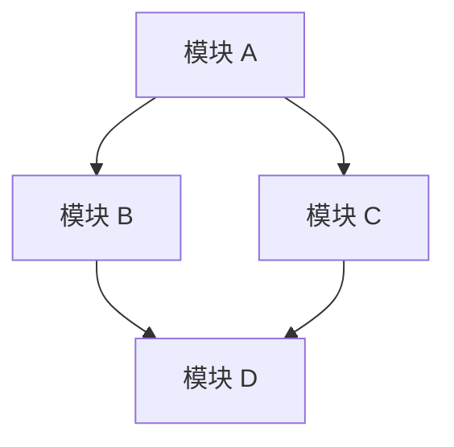
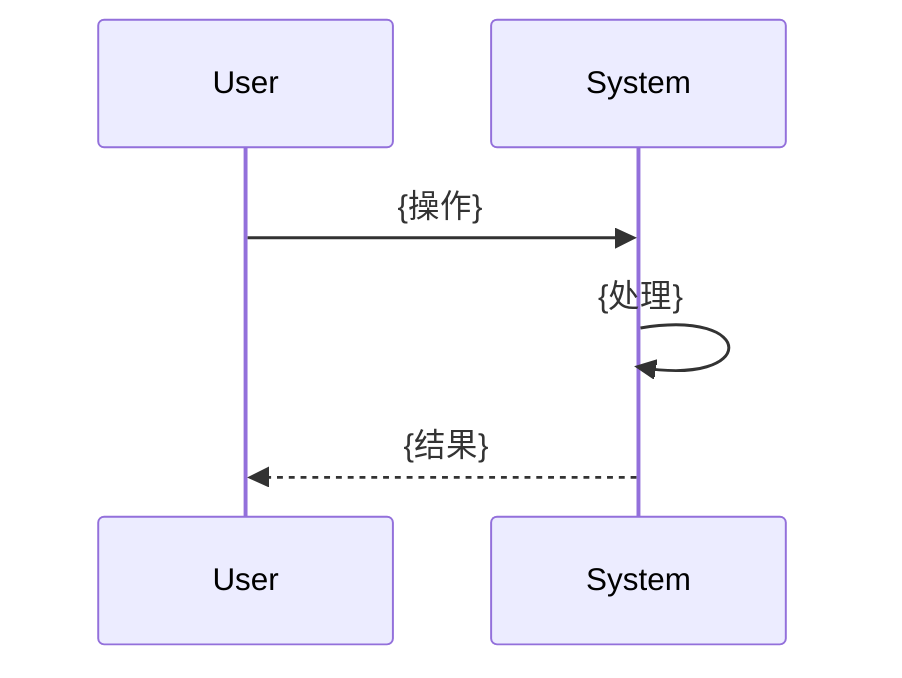

# PRD Template - 产品需求文档模板

## 使用说明

本模板用于 Product Manager 编写 PRD（Product Requirements Document）。请完整填写所有章节，不要使用占位符、省略号或 TODO 标记。

## 文档元信息

<!--
Document: PRD - Product Requirements Document
Version: 1.0.0
Author: Product Manager
Created: {YYYY-MM-DD}
Updated: {YYYY-MM-DD}
Status: Draft
-->

---

# PRD: {产品名称}

## 1. 产品概述

### 1.1 产品愿景

{一句话描述产品的愿景和目标}

### 1.2 产品定位

| 维度 | 描述 |
|------|------|
| 产品名称 | {产品名称} |
| 产品类型 | {Web应用 / 移动应用 / API服务 / 其他} |
| 目标用户 | {目标用户群体描述} |
| 核心价值 | {产品为用户提供的核心价值} |
| 竞品 | {主要竞品名称} |

### 1.3 产品目标

| 目标 | 指标 | 目标值 | 时间框架 |
|------|------|--------|----------|
| {目标 1} | {衡量指标} | {目标值} | {时间} |
| {目标 2} | {衡量指标} | {目标值} | {时间} |
| {目标 3} | {衡量指标} | {目标值} | {时间} |

## 2. 用户分析

### 2.1 目标用户

#### 用户画像 1: {用户画像名称}

| 属性 | 描述 |
|------|------|
| 名称 | {用户画像名称} |
| 人口统计 | {年龄、性别、职业等} |
| 技术能力 | {技术水平} |
| 使用场景 | {使用场景} |
| 痛点 | {核心痛点} |
| 目标 | {使用目标} |

#### 用户画像 2: {用户画像名称}

{同上}

### 2.2 用户故事

#### Epic 1: {Epic 名称}

| ID | 用户故事 | 优先级 | 验收标准 |
|----|----------|--------|----------|
| US-001 | 作为{角色}，我想要{功能}，以便{价值} | P0 | {验收标准} |
| US-002 | 作为{角色}，我想要{功能}，以便{价值} | P1 | {验收标准} |
| US-003 | 作为{角色}，我想要{功能}，以便{价值} | P1 | {验收标准} |

#### Epic 2: {Epic 名称}

{同上}

## 3. 功能需求

### 3.1 功能模块概述



### 3.2 模块 1: {模块名称}

#### 3.2.1 功能描述

{功能的详细描述}

#### 3.2.2 功能流程



#### 3.2.3 功能细节

| 功能点 | 描述 | 优先级 | 验收标准 |
|--------|------|--------|----------|
| {功能点 1} | {描述} | P0 | {验收标准} |
| {功能点 2} | {描述} | P1 | {验收标准} |

#### 3.2.4 界面原型

{界面原型描述或链接}

#### 3.2.5 业务规则

| 规则编号 | 规则描述 | 触发条件 | 预期结果 |
|----------|----------|----------|----------|
| BR-001 | {规则} | {条件} | {结果} |
| BR-002 | {规则} | {条件} | {结果} |

### 3.3 模块 2: {模块名称}

{同上}

## 4. 非功能需求

### 4.1 性能需求

| 指标 | 目标值 | 测量方法 |
|------|--------|----------|
| 页面加载时间 | < 2s (P95) | Lighthouse |
| API 响应时间 | < 200ms (P95) | APM 工具 |
| 并发用户数 | >= 1000 | 压力测试 |
| 数据库查询时间 | < 50ms (P95) | 数据库监控 |

### 4.2 安全需求

| 需求 | 说明 |
|------|------|
| 认证 | {认证方式和要求} |
| 授权 | {授权方式和要求} |
| 数据加密 | {加密要求} |
| 输入验证 | {验证要求} |
| 审计日志 | {审计要求} |

### 4.3 可用性需求

| 指标 | 目标值 |
|------|--------|
| 系统可用性 | 99.9% |
| 故障恢复时间 | < 1 小时 |
| 数据备份频率 | 每日 |
| 灾难恢复时间 | < 4 小时 |

### 4.4 可扩展性需求

| 需求 | 说明 |
|------|------|
| 水平扩展 | {是否支持水平扩展} |
| 数据量 | {预计数据量} |
| 增长预期 | {预计增长率} |

### 4.5 兼容性需求

| 平台 | 支持版本 |
|------|----------|
| Chrome | >= 100 |
| Firefox | >= 100 |
| Safari | >= 15 |
| Edge | >= 100 |
| iOS | >= 15 |
| Android | >= 12 |

## 5. 数据需求

### 5.1 数据实体

| 实体 | 描述 | 主要字段 |
|------|------|----------|
| {实体 1} | {描述} | {字段列表} |
| {实体 2} | {描述} | {字段列表} |

### 5.2 数据流


## 6. 集成需求

### 6.1 外部系统集成

| 系统 | 集成方式 | 用途 |
|------|----------|------|
| {系统 1} | {API/Webhook/消息队列} | {用途} |
| {系统 2} | {API/Webhook/消息队列} | {用途} |

### 6.2 第三方服务

| 服务 | 用途 | 备选方案 |
|------|------|----------|
| {服务 1} | {用途} | {备选} |
| {服务 2} | {用途} | {备选} |

## 7. 约束与假设

### 7.1 约束

| 约束 | 说明 |
|------|------|
| 技术约束 | {技术栈限制} |
| 时间约束 | {交付时间要求} |
| 预算约束 | {预算限制} |
| 合规约束 | {法规要求} |

### 7.2 假设

| 假设 | 说明 |
|------|------|
| {假设 1} | {说明} |
| {假设 2} | {说明} |

## 8. 优先级排序

### 8.1 MVP 范围

| 功能 | 优先级 | 理由 |
|------|--------|------|
| {功能 1} | P0 | {理由} |
| {功能 2} | P0 | {理由} |
| {功能 3} | P1 | {理由} |

### 8.2 后续迭代

| 功能 | 优先级 | 计划迭代 |
|------|--------|----------|
| {功能 4} | P2 | v1.1 |
| {功能 5} | P3 | v1.2 |

## 9. 验收标准

### 9.1 功能验收

| 功能 | 验收标准 | 验收方法 |
|------|----------|----------|
| {功能 1} | {标准} | {方法} |
| {功能 2} | {标准} | {方法} |

### 9.2 非功能验收

| 指标 | 验收标准 | 验收方法 |
|------|----------|----------|
| 性能 | {标准} | {方法} |
| 安全 | {标准} | {方法} |
| 可用性 | {标准} | {方法} |

## 10. 附录

### 10.1 术语表

| 术语 | 定义 |
|------|------|
| {术语 1} | {定义} |
| {术语 2} | {定义} |

### 10.2 参考文档

| 文档 | 链接 |
|------|------|
| {文档 1} | {链接} |
| {文档 2} | {链接} |

### 10.3 变更历史

| 版本 | 日期 | 变更说明 | 作者 |
|------|------|----------|------|
| 1.0.0 | {YYYY-MM-DD} | 初始版本 | Product Manager |

---

## 完整 PRD 示例骨架

### PRD: ShopFlow 电商平台

```markdown
# PRD: ShopFlow 电商平台

## 1. 产品概述

### 1.1 产品愿景

为中小商家提供一站式的全渠道电商管理平台，帮助他们轻松管理商品、订单、库存和营销，降低电商运营门槛。

### 1.2 产品定位

| 维度 | 描述 |
|------|------|
| 产品名称 | ShopFlow |
| 产品类型 | Web 应用（响应式，支持移动端） |
| 目标用户 | 中小商家（年销售额 10 万 - 1000 万） |
| 核心价值 | 降低电商运营门槛，提供从商品管理到订单处理的全流程解决方案 |
| 竞品 | 有赞、微盟、Shopify |

### 1.3 产品目标

| 目标 | 指标 | 目标值 | 时间框架 |
|------|------|--------|----------|
| 获取首批用户 | 注册商家数 | 100 | 发布后 1 个月 |
| 验证核心价值 | 月活跃商家数 | 50 | 发布后 3 个月 |
| 验证商业模式 | 月 GMV | 100 万 | 发布后 6 个月 |
| 用户留存 | 3 月留存率 | 60% | 发布后 6 个月 |

## 2. 用户分析

### 2.1 目标用户

#### 用户画像 1: 淘宝店主小王

| 属性 | 描述 |
|------|------|
| 名称 | 淘宝店主小王 |
| 人口统计 | 28 岁，女，已婚，大专学历 |
| 技术能力 | 会用电脑和手机，但不懂技术 |
| 使用场景 | 每天上架 5-10 个新品，处理 20-50 个订单 |
| 痛点 | 淘宝后台操作繁琐，多平台管理困难 |
| 目标 | 简化商品管理和订单处理流程，提高效率 |

#### 用户画像 2: 小型电商公司张总

| 属性 | 描述 |
|------|------|
| 名称 | 小型电商公司张总 |
| 人口统计 | 35 岁，男，本科学历，管理 5 人团队 |
| 技术能力 | 了解基本电商运营，会使用 Excel 和 ERP |
| 使用场景 | 管理 3 个平台的店铺，日订单量 100-500 |
| 痛点 | 多平台库存同步困难，订单处理效率低 |
| 目标 | 统一管理多平台，提高团队协作效率 |

### 2.2 用户故事

#### Epic 1: 用户认证

| ID | 用户故事 | 优先级 | 验收标准 |
|----|----------|--------|----------|
| US-001 | 作为商家，我想要注册账号，以便使用平台功能 | P0 | 输入邮箱和密码即可注册，注册后自动登录 |
| US-002 | 作为商家，我想要登录账号，以便访问我的数据 | P0 | 输入正确的邮箱和密码即可登录，错误时显示提示 |
| US-003 | 作为商家，我想要重置密码，以便在忘记密码时恢复账号 | P1 | 输入注册邮箱，收到重置链接，点击后设置新密码 |
| US-004 | 作为商家，我想要修改个人信息，以便更新联系方式 | P2 | 可以修改昵称、手机号、头像等信息 |

#### Epic 2: 商品管理

| ID | 用户故事 | 优先级 | 验收标准 |
|----|----------|--------|----------|
| US-005 | 作为商家，我想要创建商品，以便在店铺中展示 | P0 | 输入商品名称、价格、库存、描述、图片即可创建 |
| US-006 | 作为商家，我想要编辑商品信息，以便更新商品详情 | P0 | 可以修改商品的所有字段，修改后立即生效 |
| US-007 | 作为商家，我想要查看商品列表，以便管理所有商品 | P0 | 显示所有商品，支持分页、搜索、按状态过滤 |
| US-008 | 作为商家，我想要批量导入商品，以便快速上架 | P2 | 上传 CSV 文件，系统自动解析并创建商品 |
```

## 用户故事模板

### 标准格式

```markdown
作为{角色}，我想要{功能}，以便{价值}
```

### 用户故事拆分原则

| 原则 | 说明 | 示例 |
|------|------|------|
| INVEST | 独立、可协商、有价值、可估算、小、可测试 | 每个用户故事可以独立开发和测试 |
| 3C | Card（卡片）、Conversation（对话）、Confirmation（确认） | 卡片记录概要，对话澄清细节，确认定义验收标准 |
| 纵向拆分 | 按功能流程拆分，而非按技术层拆分 | 按"注册→登录→查看信息"拆分，而非按"前端→后端→数据库"拆分 |

### 用户故事示例

**Epic 级别用户故事**（大功能，需要拆分为多个小故事）:

```markdown
作为商家，我想要管理商品，以便在店铺中展示和销售商品
```

**Feature 级别用户故事**（可在一个迭代内完成）:

```markdown
作为商家，我想要创建商品，填写名称、价格、库存、描述和图片，以便在店铺中展示这个商品
```

**详细用户故事**（含验收标准）:

```markdown
## US-005: 创建商品

作为商家，我想要创建商品，填写名称、价格、库存、描述和图片，以便在店铺中展示这个商品。

### 验收标准

1. 商家在商品管理页面点击"新建商品"按钮
2. 系统显示商品创建表单，包含以下字段：
   - 商品名称（必填，1-100 字符）
   - 商品价格（必填，大于 0 的数字）
   - 库存数量（必填，大于等于 0 的整数）
   - 商品描述（可选，最多 2000 字符）
   - 商品图片（可选，最多 5 张，每张不超过 5MB）
3. 商家填写完必填字段后，点击"保存"按钮
4. 系统验证输入数据，如验证通过则创建商品，并跳转到商品详情页
5. 如验证不通过，在对应字段旁显示错误提示

### 边界条件

- 商品价格输入 0 或负数时，显示"价格必须大于 0"
- 商品名称输入超过 100 字符时，显示"名称不能超过 100 字符"
- 图片超过 5MB 时，显示"图片大小不能超过 5MB"
- 同时上传超过 5 张图片时，显示"最多上传 5 张图片"
```

## 验收标准模板

### 验收标准格式

每条验收标准遵循 Given-When-Then 格式：

```markdown
### 验收标准

**场景 1: 正常创建商品**

Given（前提条件）:
- 商家已登录系统
- 商家在商品管理页面

When（操作）:
- 商家点击"新建商品"按钮
- 商家填写所有必填字段：名称="新款 T 恤"，价格=99.99，库存=100
- 商家点击"保存"按钮

Then（预期结果）:
- 系统显示"商品创建成功"提示
- 页面跳转到商品详情页
- 商品详情页显示刚才填写的所有信息
- 商品状态为"已上架"
```

### 验收标准检查清单

- [ ] 每条验收标准是独立的，不依赖其他标准
- [ ] 每条验收标准是可测试的，有明确的通过/失败标准
- [ ] 验收标准覆盖了正常流程和异常流程
- [ ] 验收标准覆盖了边界条件
- [ ] 验收标准使用了具体的值，而非模糊描述
- [ ] 验收标准从用户角度描述，而非从技术角度

## 优先级定义模板

### MoSCoW 优先级模型

| 优先级 | 含义 | 说明 |
|--------|------|------|
| Must Have | 必须有 | 没有这些功能，产品无法使用 |
| Should Have | 应该有 | 重要但不是必需的，可以在后续版本中补充 |
| Could Have | 可以有 | 锦上添花，有更好，没有也可以 |
| Won't Have | 不会有 | 明确不在当前版本范围内的功能 |

### 优先级排序示例

```markdown
## 优先级排序: ShopFlow MVP

### Must Have（必须有）

| 功能 | 优先级 | 理由 |
|------|--------|------|
| 用户注册和登录 | P0 | 没有账号系统，其他功能都无法使用 |
| 商品创建和管理 | P0 | 核心功能，商家必须能管理商品 |
| 订单创建和查看 | P0 | 核心功能，商家必须能处理订单 |
| 库存管理 | P0 | 必须能追踪库存，防止超卖 |

### Should Have（应该有）

| 功能 | 优先级 | 理由 |
|------|--------|------|
| 商品分类管理 | P1 | 提升商品管理效率，但可以手动分类 |
| 订单状态筛选 | P1 | 提升订单处理效率，但可以暂时不做 |
| 数据导出功能 | P1 | 商家需要数据分析，但首批用户量小 |

### Could Have（可以有）

| 功能 | 优先级 | 理由 |
|------|--------|------|
| 批量导入商品 | P2 | 提升效率，但首批商家商品数量不多 |
| 商品模板 | P2 | 提升效率，但可以先手动创建 |
| 数据看板 | P2 | 有价值，但可以先通过导出数据实现 |

### Won't Have（不会有）

| 功能 | 优先级 | 理由 |
|------|--------|------|
| 营销活动管理 | P3 | 超出 MVP 范围，v2.0 考虑 |
| 多语言支持 | P3 | 当前目标用户是中文商家 |
| 移动端 App | P3 | 先做响应式 Web，App 后续考虑 |
```

---

**本模板必须完整填写。不要使用占位符、省略号或 TODO 标记。**